# 👋 Hi, I'm Tanveer Munir

<div align="center">

# Senior Android Engineer | Kotlin | Jetpack Compose | Clean Architecture

**Building scalable Android applications for FinTech, EdTech, HealthTech, Logistics, and Enterprise products.**

[]()
[]()
[]()
[]()
[]()
[]()

</div>

---

# About Me

I am a **Senior Android Engineer** with **10+ years of professional experience** designing, developing, and maintaining high-quality Android applications across multiple industries, including **FinTech, EdTech, HealthTech, Logistics, E-commerce, and Enterprise Solutions**.

Throughout my career, I have contributed to the development of production Android applications used by customers across different regions, delivering secure, scalable, and maintainable mobile solutions while collaborating with cross-functional teams in Agile environments.

My expertise spans the complete Android development lifecycle—from requirements analysis and architecture design to implementation, testing, deployment, and production support. I enjoy solving complex engineering challenges, modernizing legacy codebases, and building software that remains maintainable as products evolve.

I have extensive experience working with modern Android technologies, architectural patterns, and engineering best practices, with a strong focus on performance, code quality, scalability, and user experience.

---

# Career Highlights

- **10+ years** of professional Android development experience
- Built and maintained production Android applications across multiple industries
- Expertise in Kotlin-first Android development
- Strong background in Clean Architecture and MVVM
- Extensive experience with Jetpack Compose and modern Android development
- Developed secure financial applications involving authentication, payments, and user verification
- Experience integrating REST APIs and GraphQL services
- Strong understanding of scalable modular Android applications
- Worked in Agile Scrum teams with distributed engineering organizations
- Collaborated closely with Product Managers, Designers, Backend Engineers, and QA teams
- Mentored Android developers through code reviews and technical discussions
- Delivered multiple production releases through CI/CD pipelines

---

# Technical Expertise

## Languages

- Kotlin
- Java

## Android

- Android SDK
- Jetpack Compose
- Material Design
- XML
- Navigation Component
- WorkManager
- CameraX
- Bluetooth Low Energy (BLE)
- Google Maps SDK
- Push Notifications

## Architecture

- Clean Architecture
- MVVM
- MVI
- SOLID Principles
- Repository Pattern
- Modular Architecture

## Asynchronous Programming

- Kotlin Coroutines
- Kotlin Flow
- StateFlow
- SharedFlow

## Networking

- Retrofit
- OkHttp
- Apollo GraphQL
- Gson

## Local Storage

- Room
- SQLDelight
- DataStore
- SharedPreferences

## Dependency Injection

- Dagger Hilt
- Dagger 2

## Testing

- JUnit
- MockK
- Unit Testing

## Firebase

- Firebase Authentication
- Firebase Cloud Messaging
- Firebase Crashlytics
- Firebase Analytics

## CI/CD

- GitHub Actions
- Bitrise
- Fastlane

---

# Engineering Principles

My approach to Android engineering is centered around building software that remains scalable, maintainable, and reliable over time.

I strongly believe in:

- Writing clean, readable, and testable code
- Building reusable and modular components
- Designing scalable architectures
- Performance optimization
- Continuous improvement
- Knowledge sharing and mentoring
- Delivering business value through engineering excellence

---

# Leadership & Collaboration

Beyond implementation, I actively collaborate with cross-functional teams throughout the software development lifecycle.

Responsibilities have included:

- Feature planning
- Technical discussions
- Architecture reviews
- Sprint planning
- Requirement analysis
- Code reviews
- Mentoring Android developers
- Production issue investigation
- Release planning
- Working closely with Product Managers, Designers, QA Engineers, and Backend Developers

---

# Core Technology Stack

| Category | Technologies |
|-----------|--------------|
| Languages | Kotlin, Java |
| UI | Jetpack Compose, XML |
| Architecture | MVVM, MVI, Clean Architecture |
| Networking | Retrofit, Apollo GraphQL, OkHttp |
| Database | Room, SQLDelight |
| Async | Coroutines, Flow |
| DI | Dagger Hilt |
| Testing | JUnit, MockK |
| Firebase | Crashlytics, Analytics, FCM |
| CI/CD | GitHub Actions, Bitrise, Fastlane |
| Tools | Android Studio, Git, Jira, Figma |

---

# Featured Projects

The following projects demonstrate my experience designing, developing, and maintaining Android applications across multiple business domains. Each project highlights the engineering challenges, architectural decisions, technologies used, and my contributions toward delivering production-ready mobile solutions.

---

# 🚛 [Motive Driver App – AI-Powered Fleet Operations & Compliance Platform](https://play.google.com/store/apps/details?id=com.keeptruckin.android&hl=en_GB)

> **Role:** Software Engineer Android (L5)  
> **Company:** Motive  
> **Industry:** Enterprise SaaS | Fleet Management | Transportation | AI  
> **Platform:** Android

---

# Project Overview

The **Motive Driver App** is a core component of Motive's AI-powered Integrated Operations Platform, empowering commercial drivers to manage regulatory compliance, electronic logging (ELD), Hours of Service (HOS), vehicle inspections, and daily operational workflows through a secure, scalable, and high-performance Android application.

Serving commercial fleets across North America, the platform helps transportation companies improve driver safety, simplify compliance, increase operational efficiency, and gain real-time visibility into fleet operations. As part of Motive's broader ecosystem, the Driver App integrates with intelligent fleet management solutions that leverage AI, telematics, and operational insights to streamline business-critical workflows.

As a **Software Engineer Android (L5)**, I contribute to the continuous evolution of one of Motive's flagship mobile products by developing scalable Android solutions, enhancing existing capabilities, modernizing legacy components, and maintaining a high-quality production codebase. My work spans the complete software development lifecycle, from technical design and implementation to testing, release, monitoring, and long-term maintenance.

---

# Business Context

Commercial fleet operations require organizations to comply with complex transportation regulations while maintaining driver safety, operational efficiency, and business productivity. Managing compliance manually increases operational costs, introduces human error, and makes it difficult to maintain real-time visibility across large fleets.

The Motive Driver App addresses these challenges by providing a unified mobile platform that enables drivers to complete compliance workflows, inspections, document management, operational tasks, and other day-to-day activities from a single application. By digitizing these processes, the platform reduces administrative overhead, improves operational accuracy, and helps businesses remain compliant while increasing overall fleet efficiency.

---

# My Role

As a **Software Engineer Android (L5)** within the **Compliance Pod**, I collaborate with Product Managers, Product Designers, Backend Engineers, QA Engineers, Data & Analytics teams, and other engineering teams to deliver reliable, scalable, and business-focused Android solutions.

My responsibilities extend beyond feature development and include technical solution design, engineering documentation, architecture discussions, legacy code modernization, analytics integration, production support, and continuous product improvements. Working within a large-scale enterprise codebase, I contribute to building maintainable software that supports long-term product growth while delivering an exceptional user experience.

---

# Responsibilities

My key responsibilities include:

- Designing, developing, and maintaining production-ready Android features using modern Android technologies.
- Delivering compliance-related features within the Driver App that support regulatory workflows and operational efficiency.
- Enhancing existing functionality while maintaining stability across a large-scale enterprise codebase.
- Modernizing legacy components through incremental refactoring and adoption of modern Android development practices.
- Preparing Technical Solution Design (TSD) documents to support new initiatives and architectural improvements.
- Collaborating with cross-functional teams to translate business requirements into scalable technical solutions.
- Integrating analytics to measure feature adoption, user behavior, and product performance.
- Participating in technical design discussions, implementation planning, and architecture reviews.
- Performing code reviews and promoting clean, maintainable, and scalable engineering practices.
- Investigating production issues, identifying root causes, and implementing sustainable long-term fixes.
- Supporting Agile software development through sprint planning, backlog refinement, estimation, and production releases.
- Continuously improving application performance, maintainability, and overall engineering quality.

---

# Key Contributions

Throughout my work on the Motive Driver App, I have contributed to the continuous enhancement of a mission-critical enterprise application used by commercial drivers and fleet operators.

Key contributions include:

- Delivered production-ready Android features supporting compliance and operational workflows.
- Improved existing features by enhancing usability, maintainability, and application performance.
- Contributed to the modernization of legacy code while preserving production stability.
- Prepared Technical Solution Design (TSD) documentation for new features and engineering initiatives.
- Collaborated across multiple engineering teams to deliver cross-functional product capabilities.
- Integrated analytics to support data-driven product decisions and feature evaluation.
- Participated in architectural discussions to ensure scalable and maintainable implementation strategies.
- Performed code reviews and contributed to maintaining high engineering standards.
- Investigated and resolved production issues through effective debugging and root cause analysis.
- Contributed to continuous product evolution by delivering reliable, scalable, and user-focused Android solutions within an enterprise SaaS environment.

---
# Architecture

The Motive Driver App is built on a modern, scalable Android architecture designed to support a rapidly evolving enterprise platform used by commercial drivers and fleet operators. The architecture emphasizes maintainability, modularity, performance, and long-term scalability, enabling multiple engineering teams to develop and evolve features independently while maintaining a consistent user experience.

The application follows clean architectural principles with clear separation of responsibilities, allowing business logic, presentation, and data layers to evolve independently. Modern Android development practices, reactive programming, dependency injection, and modular design patterns are leveraged to support continuous product development while ensuring high code quality and maintainability.

### Architectural Principles

- Clean Architecture
- MVVM (Model–View–ViewModel)
- Repository Pattern
- SOLID Principles
- Modular Architecture
- Dependency Injection
- Reactive Programming
- Unidirectional Data Flow
- Scalable Feature-Based Design

### Architecture Overview

```text
Presentation Layer
│
├── Jetpack Compose
├── ViewModels
├── UI State Management
│
Domain Layer
│
├── Business Logic
├── Use Cases
├── Compliance Workflows
│
Data Layer
│
├── Repository
├── REST APIs
├── Local Persistence
├── Analytics
│
Core Components
│
├── Dagger Hilt
├── Kotlin Coroutines
├── Kotlin Flow
├── WorkManager
├── Firebase
├── Analytics Platform
```

The architecture provides:

- Scalable feature development across multiple engineering teams.
- Clear separation of concerns.
- Improved maintainability and code readability.
- High-performance reactive user interfaces.
- Reusable business logic and UI components.
- Efficient state management.
- Simplified testing and debugging.
- Long-term scalability for continuous product evolution.

---

# Engineering Challenges

Working on the Motive Driver App involves solving engineering challenges within a large-scale enterprise Android application that supports mission-critical workflows for commercial fleet operations.

## Large-Scale Enterprise Codebase

Developing features within a mature enterprise application requires balancing new feature development with long-term maintainability. A significant part of my work involves understanding existing architecture, improving legacy implementations, and introducing modern Android development practices without disrupting production stability.

## Compliance-Critical Workflows

The Compliance Pod is responsible for delivering features that support regulatory requirements and operational workflows. These features must be reliable, intuitive, and thoroughly tested, as they directly impact driver compliance and daily operations.

## Cross-Functional Product Development

Many initiatives span multiple engineering teams and services. Delivering these features requires close collaboration with Product Managers, Designers, Backend Engineers, QA Engineers, Analytics teams, and other engineering groups to ensure consistent implementation across the platform.

## Technical Solution Design

Before implementation, new initiatives often require Technical Solution Design (TSD) documentation, where engineering approaches, architecture decisions, implementation strategies, technical risks, and dependencies are evaluated to ensure scalable and maintainable solutions.

## Analytics-Driven Product Development

Understanding feature adoption and user behavior is an important aspect of product development. Analytics integration enables teams to evaluate product performance, validate new features, and make informed decisions for future improvements.

## Production Reliability

Supporting an enterprise SaaS platform requires maintaining high application stability through continuous monitoring, debugging, root cause analysis, and proactive improvements to ensure a reliable experience for commercial drivers.

---

# Business Impact

The Motive Driver App plays a critical role in helping transportation companies simplify regulatory compliance, improve driver productivity, and optimize fleet operations through intelligent mobile technology.

My contributions focus on delivering reliable Android solutions that enhance compliance workflows, improve maintainability, and support continuous product innovation. By modernizing legacy components, implementing scalable features, and collaborating across engineering teams, I help ensure the platform continues to evolve while maintaining a high standard of quality and performance.

Beyond feature implementation, my work contributes to engineering efficiency through technical documentation, architecture discussions, code quality improvements, and analytics-driven product development, enabling the team to deliver sustainable long-term value for customers.

---

# Key Achievements

Throughout my work on the Motive Driver App, I have contributed to the development and continuous improvement of a large-scale enterprise Android application used by commercial drivers across North America.

Key achievements include:

- Delivered production-ready Android features supporting compliance and operational workflows.
- Enhanced existing features to improve usability, scalability, and long-term maintainability.
- Contributed to the modernization of legacy code by adopting modern Android development practices.
- Prepared Technical Solution Design (TSD) documentation for new product initiatives.
- Collaborated across multiple engineering teams to deliver cross-functional features.
- Participated in architectural discussions and technical planning sessions.
- Integrated analytics to support feature evaluation and data-driven product decisions.
- Performed code reviews while promoting engineering best practices and code quality.
- Investigated production issues, performed root cause analysis, and implemented sustainable solutions.
- Supported Agile product development through sprint planning, estimation, backlog refinement, and production releases.
- Contributed to continuous improvements in engineering processes, application performance, and software maintainability.
- Helped deliver reliable Android experiences within a large-scale enterprise SaaS platform serving commercial fleet operations.

---

# Professional Growth

Working at Motive has significantly strengthened my expertise in enterprise Android development, product engineering, and large-scale software architecture.

The project has expanded my experience in:

- Enterprise Android Development
- Product Engineering
- Large-Scale Mobile Applications
- Modern Android Architecture
- Technical Solution Design (TSD)
- Cross-Functional Engineering
- Legacy Code Modernization
- Analytics-Driven Product Development
- Production Support
- Root Cause Analysis
- Code Reviews
- Engineering Documentation
- Software Architecture
- Agile Product Development
- Continuous Delivery
- Scalable Mobile Systems
- Building Business-Critical Enterprise Software

# Technologies

The Motive Driver App is developed using a modern Android technology stack that supports scalability, maintainability, and rapid feature delivery across a large enterprise platform. The project follows industry best practices and leverages modern Android frameworks to build reliable, high-performance mobile experiences.

| Category | Technologies |
|-----------|--------------|
| **Programming Language** | Kotlin |
| **UI Development** | Jetpack Compose, Material Design 3 |
| **Architecture** | Clean Architecture, MVVM, Repository Pattern, SOLID Principles, Modular Architecture |
| **Asynchronous Programming** | Kotlin Coroutines, Flow, StateFlow |
| **Dependency Injection** | Dagger Hilt |
| **Networking** | Retrofit, OkHttp, REST APIs |
| **Background Processing** | WorkManager |
| **Analytics & Monitoring** | Firebase Analytics, Firebase Crashlytics, Internal Analytics Platform |
| **Development Tools** | Android Studio, Git, GitHub, Jira, Figma, Postman |
| **Development Practices** | Code Reviews, Technical Design Documents (TSD), Agile Scrum, CI/CD |

---

# Engineering Practices

Working on Motive has provided extensive experience in developing enterprise-grade Android applications using modern engineering principles and collaborative product development practices.

Engineering practices include:

- Developing scalable Android applications using Kotlin and Jetpack Compose.
- Applying Clean Architecture and SOLID principles across feature development.
- Designing modular and reusable components to improve maintainability.
- Managing reactive UI state using Kotlin Coroutines, Flow, and StateFlow.
- Preparing Technical Solution Design (TSD) documentation before implementation.
- Participating in architecture discussions and technical planning sessions.
- Modernizing legacy modules through incremental refactoring while maintaining production stability.
- Collaborating with Product Managers, Product Designers, Backend Engineers, QA Engineers, and Analytics teams throughout the feature lifecycle.
- Integrating analytics to evaluate feature adoption and support data-driven product decisions.
- Performing code reviews and maintaining engineering quality standards.
- Investigating production issues through debugging and root cause analysis.
- Supporting continuous integration, production releases, and post-release monitoring.
- Contributing to Agile ceremonies including sprint planning, backlog refinement, estimation, retrospectives, and release planning.

---

# Skills Demonstrated

The Motive Driver App showcases experience in developing and maintaining large-scale enterprise Android applications within a fast-paced product engineering environment.

## Technical Skills

- Android SDK
- Kotlin
- Jetpack Compose
- Material Design 3
- Clean Architecture
- MVVM
- Repository Pattern
- SOLID Principles
- Modular Architecture
- Kotlin Coroutines
- Flow
- StateFlow
- Dagger Hilt
- Retrofit
- OkHttp
- REST API Integration
- WorkManager
- Firebase Analytics
- Firebase Crashlytics
- Git
- GitHub
- Jira
- CI/CD

---

## Enterprise Engineering Skills

- Enterprise Android Development
- Product Engineering
- Large-Scale Mobile Applications
- Feature Lifecycle Management
- Technical Solution Design (TSD)
- Legacy Code Modernization
- Cross-Functional Collaboration
- Engineering Documentation
- Code Reviews
- Software Architecture
- Production Support
- Root Cause Analysis
- Performance Optimization
- Technical Planning
- Continuous Delivery
- Agile Software Development

---

## Product & Business Skills

- Fleet Compliance Solutions
- Driver Workflow Optimization
- Enterprise SaaS Development
- Transportation Technology
- Regulatory Compliance
- Analytics-Driven Product Development
- Feature Adoption Analysis
- Product Quality Improvement
- Customer-Centric Development
- Scalable Mobile Solutions

---

# Engineering Highlights

Beyond feature development, I actively contribute to engineering excellence across the Android team by participating in architectural discussions, preparing Technical Solution Design (TSD) documents, reviewing implementation approaches, and collaborating across multiple engineering teams.

My work focuses on building scalable, maintainable, and production-ready solutions while continuously improving code quality, modernizing legacy components, and supporting long-term product evolution.

Working within a large enterprise codebase has strengthened my ability to balance feature delivery with engineering sustainability, ensuring that new capabilities integrate seamlessly into an evolving platform while maintaining reliability for production users.

---

# Screenshots

The following screenshots showcase the **Motive Driver App**, highlighting key workflows for commercial drivers, including compliance management, Hours of Service (HOS), electronic logging, inspections, operational tasks, profile management, and other core fleet operations that support safe, efficient, and compliant transportation.

<p align="center">

<!-- Replace these image paths with your actual screenshots -->

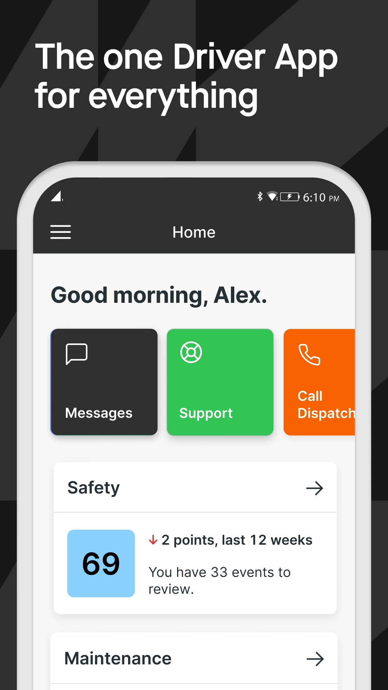
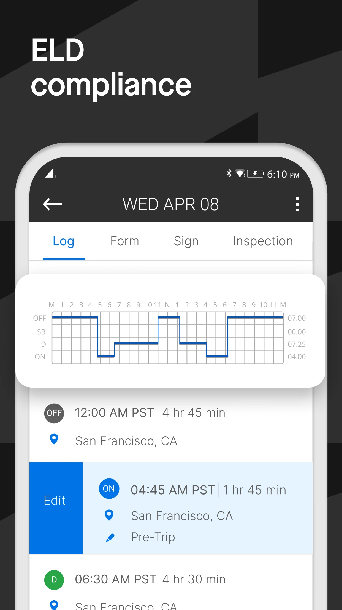
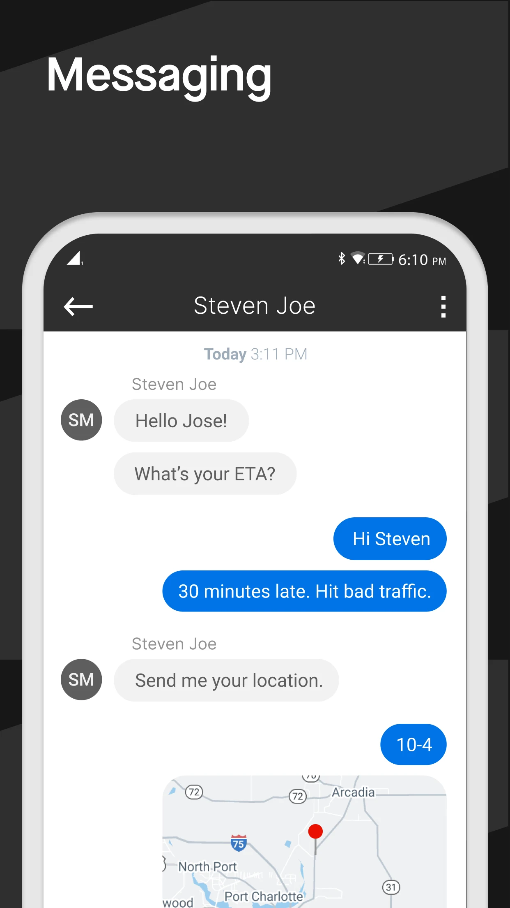
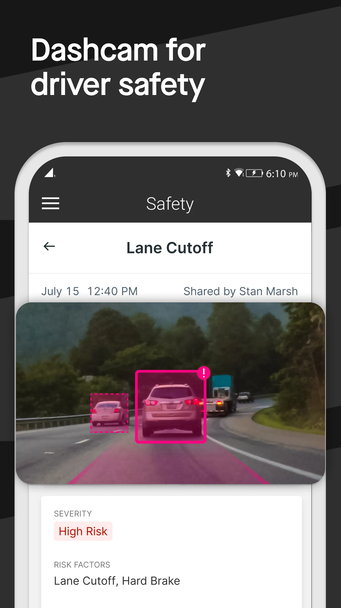

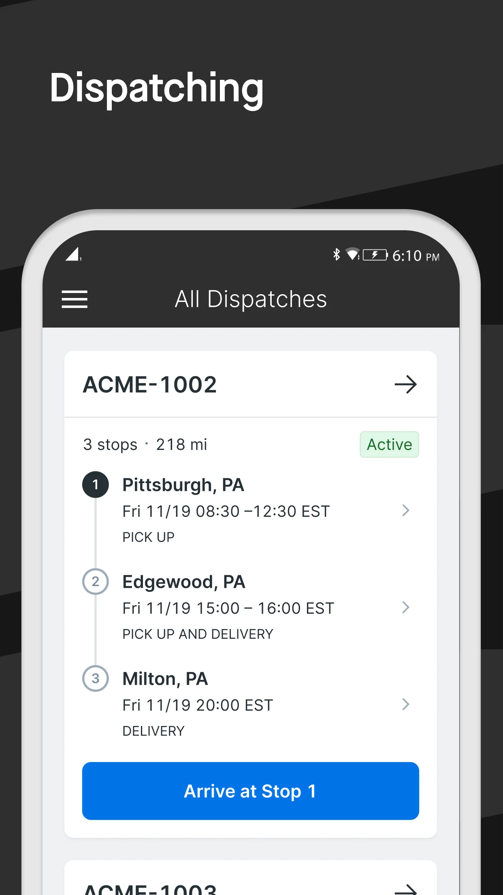
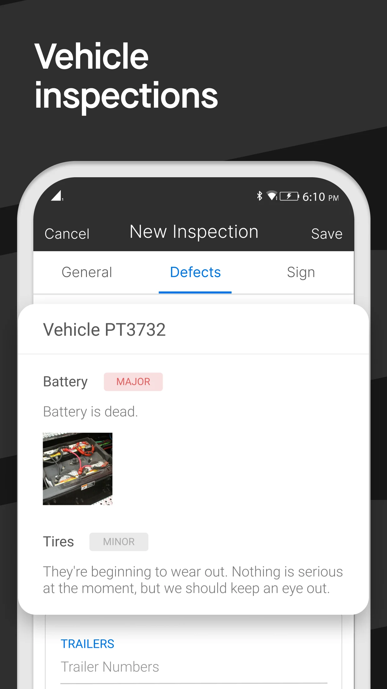
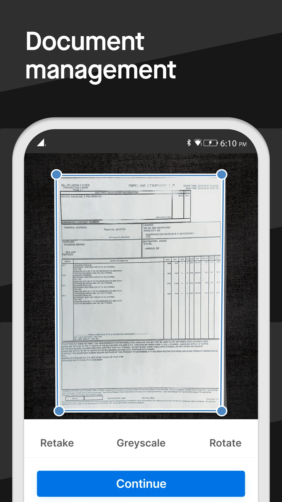

</p>

# Project Summary

Working at **Motive** represents the most significant milestone in my Android engineering career, providing the opportunity to contribute to one of the industry's leading enterprise fleet management platforms.

As a **Software Engineer Android (L5)** within the **Compliance Pod**, I contribute to designing, developing, and maintaining business-critical Android features that support regulatory compliance, operational efficiency, and driver productivity. My responsibilities extend across the full software development lifecycle, including feature implementation, technical solution design, architecture discussions, analytics integration, production support, legacy code modernization, and continuous product improvement.

Beyond delivering features, I collaborate closely with Product Managers, Designers, Backend Engineers, QA Engineers, Analytics teams, and fellow Android engineers to translate complex business requirements into scalable, maintainable, and high-quality mobile solutions.

This role has significantly strengthened my expertise in enterprise Android architecture, product engineering, technical leadership, cross-functional collaboration, and building software that serves mission-critical business operations at scale. It reflects my evolution from implementing mobile features to contributing strategically to the long-term success and technical direction of a globally recognized enterprise SaaS platform.

---

# 🚀 [Mindvalley – Personal Growth & Learning Platform](https://play.google.com/store/apps/details?id=com.mindvalley.mva&hl=en)

> **Role:** Senior Android Engineer  
> **Industry:** EdTech | Personal Development | Digital Learning  
> **Platform:** Android

---

## Project Overview

Mindvalley is one of the world's leading personal growth and digital learning platforms, empowering millions of learners through transformational education, guided programs, coaching sessions, wellness content, and immersive learning experiences. The Android application enables users to access premium educational content anytime and anywhere while delivering a seamless, engaging, and personalized mobile experience.

The platform continuously evolves by introducing new learning experiences, improving user engagement, and expanding its educational ecosystem. Building and maintaining such a large-scale Android application required a strong focus on software architecture, scalability, performance, maintainability, and user experience.

As part of the Android engineering team, I contributed to developing high-quality mobile solutions that aligned with both engineering best practices and business objectives while supporting continuous product growth.

---

## Business Context

Mindvalley's Android application serves as one of the primary touchpoints between the company and its global community of learners. It is responsible for delivering educational programs, personalized learning journeys, multimedia content, progress tracking, notifications, and interactive user experiences that encourage continuous learning and engagement.

Given the scale and continuous evolution of the platform, maintaining a clean, scalable, and maintainable architecture was essential for supporting frequent feature releases without compromising application quality or user experience.

Working within a collaborative Agile environment, I helped deliver Android features that supported the company's long-term product vision while ensuring engineering excellence throughout the development lifecycle.

---

## My Role

As a **Senior Android Engineer**, I collaborated closely with Product Managers, Designers, Backend Engineers, QA Engineers, and fellow Android developers to design, develop, test, and maintain production-ready Android features.

Beyond feature implementation, I actively participated in architecture discussions, technical planning, code reviews, debugging production issues, release preparation, and continuous improvement initiatives that contributed to the overall quality of the application.

My responsibilities extended across the complete Android development lifecycle, from understanding business requirements to delivering production-ready solutions and supporting post-release improvements.

---

## Responsibilities

My responsibilities throughout the project included:

- Designing and developing scalable Android features using Kotlin.
- Translating business requirements into maintainable technical solutions.
- Building reusable UI components using Jetpack Compose and XML.
- Applying Clean Architecture principles to maintain a modular and scalable codebase.
- Following MVVM architecture to ensure separation of concerns.
- Integrating GraphQL services using Apollo.
- Consuming REST APIs where required.
- Managing asynchronous operations using Kotlin Coroutines and Flow.
- Participating in architecture discussions and technical planning sessions.
- Collaborating with Product Managers to understand feature requirements.
- Working closely with UX/UI designers to deliver polished user experiences.
- Coordinating with backend teams to integrate APIs and validate business logic.
- Supporting QA during testing cycles and release preparation.
- Investigating production issues using Firebase Crashlytics.
- Performing code reviews and promoting Android development best practices.
- Participating in Agile ceremonies including sprint planning, estimation, backlog refinement, retrospectives, and release planning.
- Supporting CI/CD pipelines to ensure reliable application delivery.

---

## Key Contributions

Working on Mindvalley provided the opportunity to contribute across multiple areas of Android engineering, from feature implementation to architecture improvements and application stability.

Major contributions included:

- Developed production-ready Android features using Kotlin and modern Android development practices.
- Built reusable and maintainable UI components that improved development efficiency and consistency throughout the application.
- Applied Clean Architecture and MVVM principles to improve scalability and long-term maintainability.
- Contributed to modular application development by keeping features loosely coupled and easy to extend.
- Integrated GraphQL APIs using Apollo while maintaining clean abstraction between presentation and data layers.
- Utilized Kotlin Coroutines and Flow to simplify asynchronous operations and improve application responsiveness.
- Collaborated closely with backend teams to ensure seamless API integration and reliable data synchronization.
- Improved engineering quality through code reviews, knowledge sharing, and adherence to coding standards.
- Worked with designers to implement responsive, intuitive, and visually consistent user interfaces.
- Investigated production issues using Firebase Crashlytics and participated in resolving stability-related issues.
- Contributed to continuous improvements that supported maintainability, scalability, and long-term product evolution.
- Worked within Agile development practices to deliver features through iterative development and continuous feedback.

---
## Architecture

The Mindvalley Android application follows modern Android development principles and scalable software architecture to support continuous product evolution while maintaining high standards of code quality, performance, and maintainability.

The architecture emphasizes clear separation of responsibilities, modular development, reusable components, and testable code, enabling multiple engineering teams to collaborate efficiently while minimizing technical debt.

### Architectural Principles

- Clean Architecture
- MVVM (Model–View–ViewModel)
- Repository Pattern
- SOLID Principles
- Modular Architecture
- Dependency Injection
- Reactive Programming
- Single Source of Truth
- Unidirectional Data Flow (where applicable)

### Architecture Overview

```text
Presentation Layer
│
├── Jetpack Compose / XML
├── ViewModels
├── UI State
│
Domain Layer
│
├── Use Cases
├── Business Logic
│
Data Layer
│
├── Repository
├── Apollo GraphQL
├── Retrofit APIs
├── Room / SQLDelight
├── Firebase Services
│
Core Libraries
│
├── Dagger Hilt
├── Kotlin Coroutines
├── Kotlin Flow
```

This architectural approach provides several long-term benefits, including:

- Better scalability for future feature development.
- Improved code maintainability.
- Clear separation between business logic and presentation.
- Simplified testing and debugging.
- Increased code reusability.
- Easier collaboration between engineering teams.
- Reduced technical debt over time.

---

## Engineering Challenges

Working on a mature production application serving a global audience presented several technical challenges that required thoughtful engineering decisions and close collaboration across teams.

Some of the key challenges included:

### Scalable Feature Development

As the product continued to evolve, new features needed to integrate seamlessly with the existing architecture while maintaining long-term maintainability and minimizing technical debt.

### Complex UI State Management

Managing asynchronous data, user interactions, and dynamic UI updates required careful state management to ensure smooth and responsive user experiences.

### Large Codebase Maintenance

Working within a continuously growing Android codebase required following established architectural patterns, writing clean and reusable code, and maintaining consistency across multiple feature modules.

### API Integration

The application relied on GraphQL and REST services to retrieve personalized content, user progress, and learning resources. Ensuring reliable communication, proper error handling, and efficient data synchronization was essential for delivering a seamless experience.

### Production Stability

Maintaining application stability across a diverse Android ecosystem required proactive monitoring, debugging, and issue resolution using Firebase Crashlytics and structured debugging techniques.

### Cross-functional Collaboration

Delivering complex features required close collaboration with Product Managers, Designers, Backend Engineers, and QA Engineers throughout planning, implementation, testing, and release phases.

---

## Business Impact

Mindvalley's Android application is a critical platform for delivering digital learning experiences to users worldwide. Every feature contributes toward improving accessibility, engagement, and the overall learning journey.

My contributions focused on developing scalable Android solutions that aligned with business objectives while supporting continuous product innovation.

By applying modern Android engineering practices and maintaining a clean architecture, I helped contribute to a codebase capable of supporting ongoing feature development, continuous releases, and long-term product evolution.

Working collaboratively with cross-functional teams enabled efficient delivery of new capabilities while maintaining application quality, engineering standards, and a consistent user experience.

---

## Key Achievements

Throughout the project, I contributed to the successful delivery and continuous improvement of the Android application by applying modern software engineering principles and Android best practices.

Some of my key achievements include:

- Delivered multiple production-ready Android features throughout the product lifecycle.
- Contributed to the modernization of the Android application using Kotlin and modern Android development practices.
- Applied Clean Architecture and MVVM principles to improve maintainability, scalability, and code organization.
- Built reusable Android components that reduced duplication and simplified future feature development.
- Integrated GraphQL services using Apollo while maintaining a clean networking architecture.
- Utilized Kotlin Coroutines and Flow to simplify asynchronous programming and state management.
- Contributed to modular Android development that supported long-term application growth.
- Improved engineering quality through code reviews and adherence to coding standards.
- Investigated and resolved production issues using Firebase Crashlytics.
- Collaborated closely with backend engineers to ensure reliable API integration.
- Worked alongside Product Managers and Designers to translate business requirements into high-quality Android features.
- Participated in architecture discussions that supported the long-term evolution of the Android application.
- Supported Agile development through sprint planning, backlog refinement, technical estimation, and iterative delivery.
- Contributed to reliable software delivery through established CI/CD pipelines and engineering best practices.
- Continuously focused on writing clean, maintainable, and testable code that supports future scalability.

---

## Professional Growth

Working on Mindvalley strengthened my expertise in building and maintaining enterprise-scale Android applications using modern development practices.

The project provided valuable experience in:

- Large-scale Android application development.
- Designing maintainable and scalable software architectures.
- Building reusable UI components.
- Modern Kotlin development.
- Reactive programming with Coroutines and Flow.
- GraphQL integration using Apollo.
- Cross-functional collaboration.
- Agile software development.
- Production debugging and monitoring.
- Code reviews and engineering collaboration.
- Continuous Integration and Continuous Delivery (CI/CD).
- Delivering high-quality software in a fast-paced product environment.

---
## Technologies

The project was built using modern Android development tools, libraries, and architectural patterns to ensure scalability, maintainability, performance, and long-term product evolution.

| Category | Technologies |
|-----------|--------------|
| **Programming Languages** | Kotlin, Java |
| **UI Development** | Jetpack Compose, XML, Material Design |
| **Architecture** | Clean Architecture, MVVM, Repository Pattern, SOLID Principles, Modular Architecture |
| **Asynchronous Programming** | Kotlin Coroutines, Kotlin Flow, StateFlow, SharedFlow |
| **Networking** | Apollo GraphQL, Retrofit, OkHttp |
| **Local Storage** | Room, SQLDelight, DataStore, SharedPreferences |
| **Dependency Injection** | Dagger Hilt |
| **Firebase** | Firebase Authentication, Firebase Analytics, Firebase Cloud Messaging (FCM), Firebase Crashlytics |
| **Testing** | JUnit, MockK, Unit Testing |
| **CI/CD** | GitHub Actions, Bitrise |
| **Development Tools** | Android Studio, Git, GitHub, Jira, Figma |

---

## Engineering Practices

Throughout the project, I consistently followed modern software engineering practices to ensure code quality, maintainability, and efficient collaboration across the development team.

These practices included:

- Writing clean, readable, and maintainable Kotlin code.
- Applying SOLID principles and Clean Architecture to support long-term scalability.
- Developing reusable UI components to improve consistency and reduce duplication.
- Following code review best practices and maintaining coding standards.
- Writing modular code to simplify future enhancements.
- Participating in technical discussions and architecture reviews.
- Collaborating closely with Product Managers, Designers, Backend Engineers, and QA teams.
- Investigating production issues and implementing sustainable solutions.
- Supporting continuous improvement through Agile development methodologies.
- Contributing to stable and reliable application releases through CI/CD pipelines.

---

## Skills Demonstrated

This project strengthened both my technical expertise and collaborative engineering skills.

### Technical Skills

- Android SDK
- Kotlin
- Jetpack Compose
- XML
- Clean Architecture
- MVVM
- Repository Pattern
- SOLID Principles
- GraphQL (Apollo)
- Retrofit
- Room
- SQLDelight
- Kotlin Coroutines
- Kotlin Flow
- Dagger Hilt
- Firebase
- CI/CD
- GitHub Actions
- Bitrise

### Engineering Skills

- Software Architecture
- Mobile Application Design
- Feature Development
- Performance Optimization
- Production Support
- Code Review
- Debugging
- Root Cause Analysis
- API Integration
- Agile Development
- Cross-functional Collaboration
- Technical Planning
- Software Quality
- Problem Solving
- Continuous Improvement

---

## Screenshots

The following screenshots highlight various features and user experiences within the Mindvalley Android application.

<p align="center">

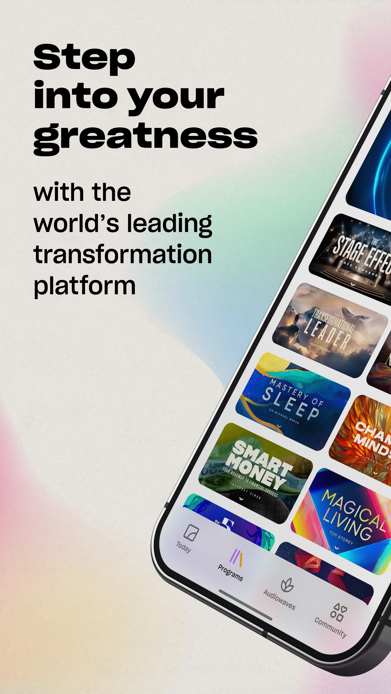
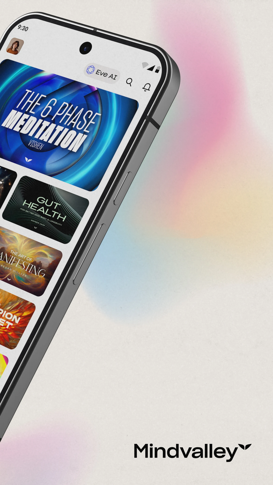
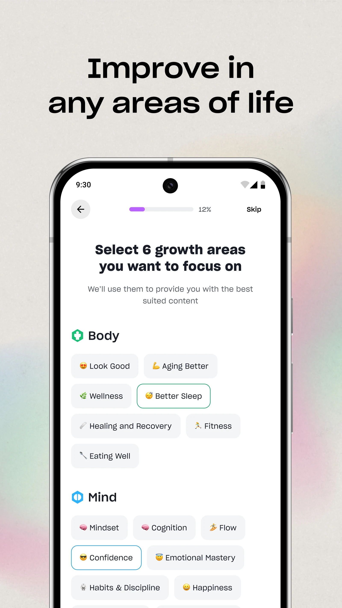
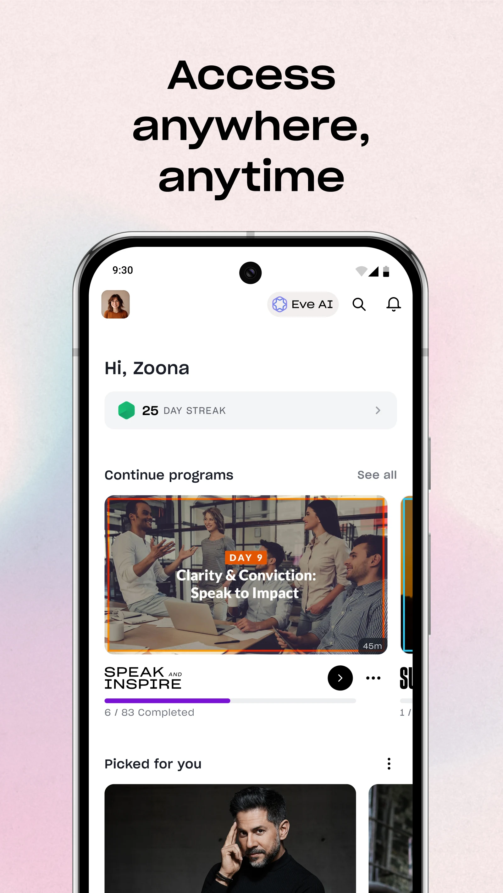

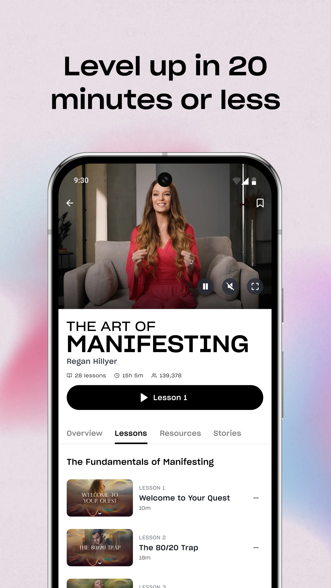

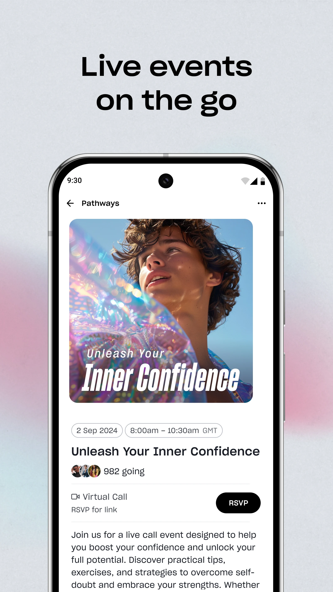
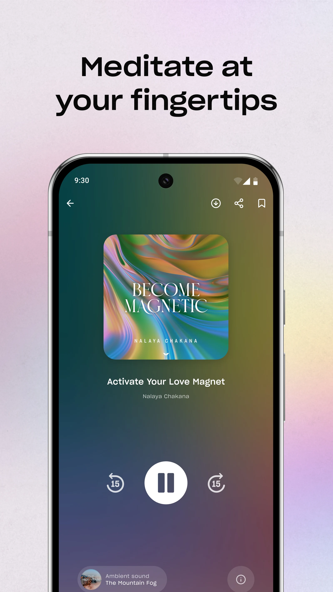

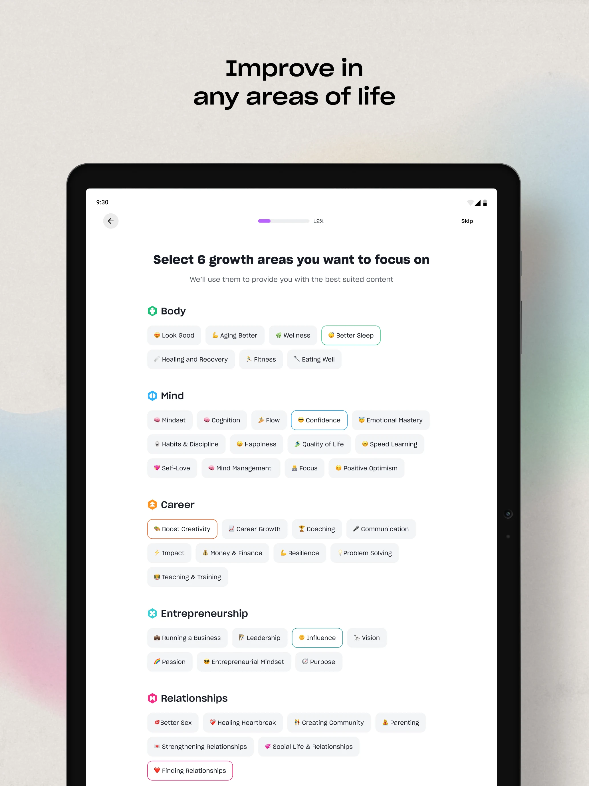
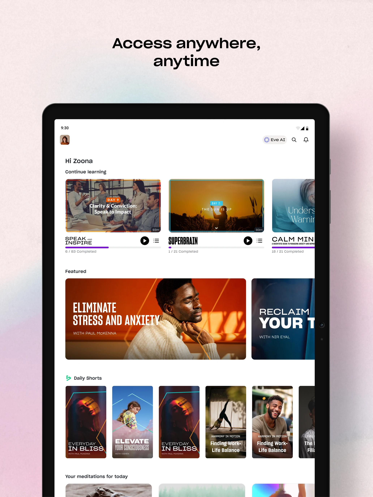
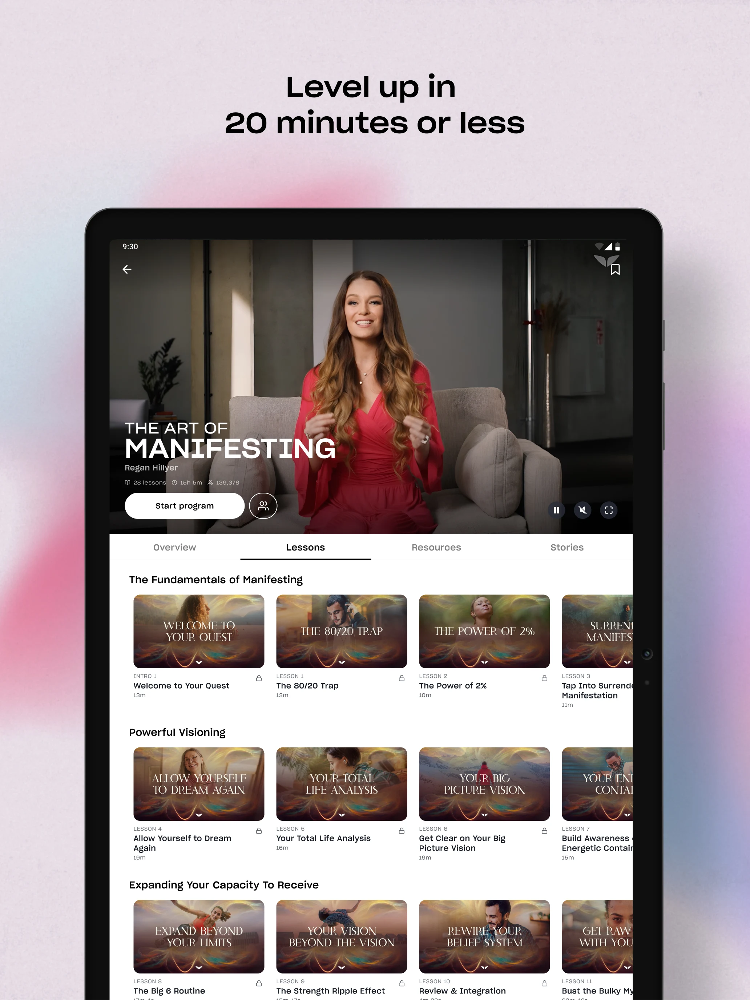


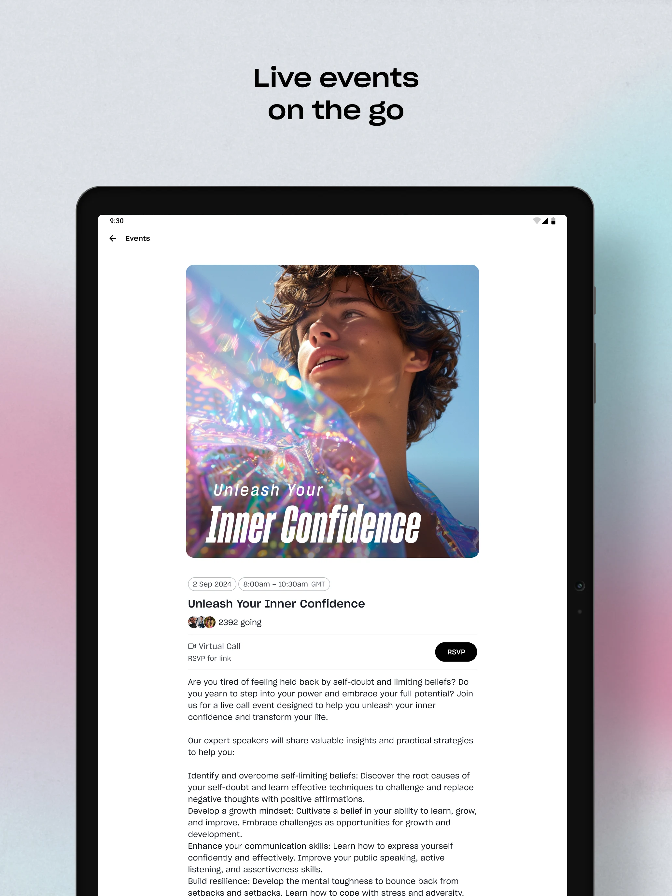
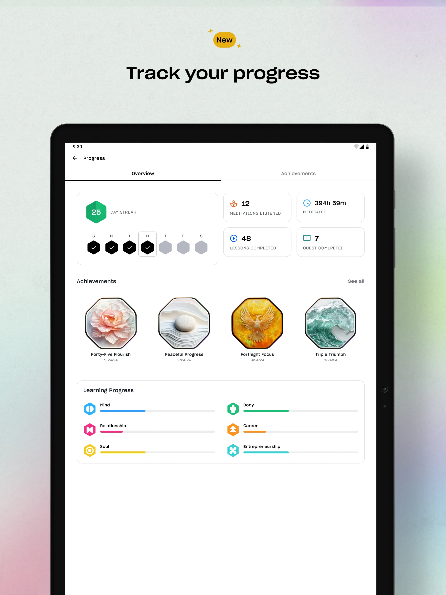

</p>

---

## Project Summary

Working on **Mindvalley** has been one of the most rewarding experiences of my career as an Android Engineer. It provided the opportunity to contribute to a globally recognized digital learning platform while working alongside talented cross-functional teams in a collaborative Agile environment.

Throughout the project, I was involved in designing and delivering production-ready Android features, improving application architecture, integrating modern technologies, maintaining application quality, and supporting continuous product evolution. By applying modern Android development practices, scalable architectural patterns, and engineering best practices, I contributed to building a reliable, maintainable, and user-focused mobile application.

This project strengthened my expertise in enterprise Android development, Clean Architecture, Jetpack Compose, GraphQL integration, asynchronous programming with Kotlin Coroutines and Flow, CI/CD, production support, and collaborative software engineering. It also reinforced the importance of writing maintainable code, embracing continuous learning, and delivering high-quality mobile experiences that align with both technical and business objectives.

Mindvalley remains one of the flagship projects in my professional portfolio, demonstrating my experience in building scalable Android applications using modern technologies, collaborating across multidisciplinary teams, and contributing to products that continuously evolve to meet the needs of users around the world.

---

# ♻️ [ScrapBays – Digital Scrap Trading Marketplace](https://play.google.com/store/apps/details?id=com.scrapbays.scrapbaysapp&hl=en_GB)

> **Role:** Senior Android Developer  
> **Industry:** Circular Economy | Recycling | Marketplace | Sustainability  
> **Platform:** Android


## Project Overview

ScrapBays is a modern digital marketplace that connects individuals, businesses, and recycling companies through a unified platform for buying, selling, and managing recyclable materials. The application simplifies the entire recycling process by enabling users to list scrap materials, browse available listings, communicate with buyers and sellers, manage orders, and monitor transactions through a secure and intuitive Android application.

The platform promotes sustainability by digitizing the recycling ecosystem and creating a transparent marketplace that helps reduce waste while supporting businesses and individuals participating in the circular economy.

Built using modern Android technologies, the application focuses on scalability, performance, security, and an exceptional user experience while supporting continuous product evolution.

---

## Business Context

Traditional scrap trading often relies on fragmented communication, manual processes, and limited market visibility. ScrapBays addresses these challenges by providing a centralized digital marketplace where users can efficiently buy, sell, and manage recyclable materials.

The platform improves transparency, streamlines trading workflows, and enables users to discover opportunities through an intuitive mobile experience. By digitizing the entire process, ScrapBays supports business growth while contributing to environmental sustainability and the circular economy.

---

## My Role

As a **Senior Android Developer**, I collaborated closely with Product Managers, UX/UI Designers, Backend Engineers, QA Engineers, and stakeholders throughout the complete software development lifecycle.

My responsibilities included designing, developing, reviewing, testing, and maintaining Android features while participating in architecture discussions, technical planning, code reviews, production support, and continuous platform improvements.

I contributed to building scalable Android solutions using modern development practices, ensuring the application remained reliable, maintainable, and capable of supporting future business growth.

---

## Responsibilities

My responsibilities included:

- Developing Android features using Kotlin and Jetpack Compose.
- Designing scalable application architecture using Clean Architecture and MVVM.
- Implementing secure user authentication and account management.
- Developing marketplace functionality for buying and selling recyclable materials.
- Building product listings, categories, and advanced search experiences.
- Implementing order management and order tracking workflows.
- Developing image capture and upload functionality for marketplace listings.
- Integrating Google Maps and location services for location-aware features.
- Implementing push notifications for marketplace activity and order updates.
- Integrating REST APIs with backend marketplace services.
- Utilizing Kotlin Coroutines and Flow for asynchronous programming and reactive UI updates.
- Building reusable Compose UI components and shared business modules.
- Applying Dependency Injection using Dagger Hilt.
- Participating in architecture discussions and technical planning.
- Conducting code reviews and maintaining Android engineering standards.
- Monitoring production stability using Firebase Crashlytics and Analytics.
- Collaborating closely with cross-functional teams in an Agile development environment.
- Supporting CI/CD pipelines and production releases.

---

## Key Contributions

Throughout the project, I contributed to delivering modern Android features that enhanced the marketplace experience and supported continuous platform growth.

Key contributions included:

- Developed production-ready Android features using Kotlin and Jetpack Compose.
- Built scalable marketplace workflows supporting buying and selling of recyclable materials.
- Developed product listing, browsing, search, and category management features.
- Implemented secure authentication and user profile management.
- Developed image capture and upload functionality for marketplace listings.
- Integrated Google Maps and location-based services to improve user experience.
- Built order management and order tracking functionality.
- Integrated REST APIs supporting marketplace operations and real-time data synchronization.
- Applied Clean Architecture, MVVM, and Repository Pattern to improve scalability and maintainability.
- Utilized Kotlin Coroutines and Flow for efficient asynchronous operations and state management.
- Developed reusable Compose components that improved consistency and accelerated feature development.
- Participated in code reviews, architecture discussions, and technical decision-making.
- Investigated production issues using Firebase Crashlytics and implemented long-term improvements.
- Collaborated closely with Product Managers, Designers, Backend Engineers, and QA Engineers to deliver high-quality Android solutions.

---

## Architecture

ScrapBays was architected using modern Android development principles to support a scalable, maintainable, and high-performance marketplace platform. As the application continued to evolve with new marketplace capabilities, the architecture emphasized modularity, reusable components, clean separation of concerns, and reactive state management.

The application leverages modern Android technologies to ensure a responsive user experience, efficient network communication, and long-term maintainability while enabling rapid feature delivery.

### Architectural Principles

- Clean Architecture
- MVVM (Model–View–ViewModel)
- Repository Pattern
- SOLID Principles
- Modular Architecture
- Dependency Injection
- Reactive Programming
- Single Source of Truth
- Unidirectional Data Flow

### Architecture Overview

```text
Presentation Layer
│
├── Jetpack Compose
├── ViewModels
├── UI State Management
│
Domain Layer
│
├── Use Cases
├── Business Logic
│
Data Layer
│
├── Repository
├── REST APIs
├── Local Persistence
│
Core Libraries
│
├── Dagger Hilt
├── Kotlin Coroutines
├── Kotlin Flow
├── WorkManager
├── Firebase
```

The architecture enabled:

- Independent feature development across marketplace modules.
- Improved code maintainability and scalability.
- Reusable business logic and UI components.
- Better testability and debugging.
- Responsive user interfaces with reactive state management.
- Faster delivery of new marketplace features.

---

## Engineering Challenges

Building a modern marketplace application presented several technical challenges involving scalability, media handling, asynchronous operations, and delivering a seamless user experience.

### Marketplace Data Management

Supporting dynamic product listings, categories, search results, and user-generated content required efficient API communication and responsive UI updates while maintaining a smooth browsing experience.

### Image Capture & Upload

Marketplace listings relied heavily on high-quality product images. The application required efficient camera integration, image processing, compression, and reliable uploads while minimizing network usage and maintaining image quality.

### Location-Based Features

Location services were integrated to improve marketplace discovery and provide users with geographically relevant listings and trading opportunities.

### State Management

Managing multiple user journeys—including authentication, listing creation, browsing, search, profile management, and order tracking—required robust state management to ensure a consistent and responsive user experience.

### Performance & Scalability

As new marketplace features were introduced, maintaining application performance, minimizing technical debt, and preserving a clean architecture became essential to supporting long-term product growth.

### Cross-functional Collaboration

Feature delivery required close collaboration with Product Managers, UX/UI Designers, Backend Engineers, QA Engineers, and stakeholders to ensure business requirements were translated into scalable, production-ready Android solutions.

---

## Business Impact

ScrapBays modernizes the recycling industry by providing a digital marketplace that connects buyers and sellers through an intuitive and reliable mobile application.

My contributions focused on delivering scalable Android features that simplified marketplace interactions, improved product discovery, streamlined listing management, and enhanced the overall trading experience.

By implementing modern Android architecture, reusable components, and efficient API integrations, I contributed to a platform capable of supporting continuous business growth while delivering a reliable experience for a growing user base of **10K+ users**.

The project also supports sustainability by making recycling more accessible and efficient, helping businesses and individuals participate in the circular economy through digital technology.

---

## Key Achievements

Throughout the project, I contributed to the successful delivery of modern Android features that strengthened the overall marketplace platform.

Key achievements include:

- Developed production-ready Android features using Kotlin and Jetpack Compose.
- Built scalable marketplace workflows supporting the buying and selling of recyclable materials.
- Implemented secure authentication and user profile management.
- Developed product listing, search, category browsing, and marketplace discovery features.
- Built image capture, processing, and upload functionality for marketplace listings.
- Integrated Google Maps and location services to improve user engagement.
- Implemented order management and order tracking workflows.
- Integrated REST APIs for marketplace operations and real-time data synchronization.
- Applied Clean Architecture, MVVM, and Repository Pattern to improve scalability and maintainability.
- Utilized Kotlin Coroutines and Flow for efficient asynchronous programming and reactive UI state management.
- Developed reusable Jetpack Compose components that improved UI consistency and accelerated feature development.
- Participated in architecture discussions, technical planning, and code reviews.
- Investigated production issues using Firebase Crashlytics and implemented long-term improvements.
- Collaborated closely with Product Managers, Designers, Backend Engineers, and QA Engineers throughout the software development lifecycle.
- Supported CI/CD pipelines and contributed to reliable production releases.
- Helped deliver a modern Android application serving a growing marketplace with **10K+ users**.

---

## Professional Growth

Working on ScrapBays significantly strengthened my expertise in building enterprise-scale marketplace applications using modern Android technologies.

The project expanded my experience in:

- Enterprise Android application development.
- Marketplace and e-commerce platforms.
- Jetpack Compose and modern UI development.
- Clean Architecture and MVVM.
- Modular application design.
- Kotlin Coroutines and Flow.
- Reactive state management.
- REST API integration.
- Google Maps and location services.
- Media capture and file upload workflows.
- Firebase services and production monitoring.
- CI/CD and release management.
- Agile software development.
- Cross-functional collaboration.
- Building scalable, maintainable, and production-ready Android applications.

---

## Technologies

ScrapBays was developed using a modern Android technology stack to deliver a scalable, secure, and high-performance marketplace platform. The application leverages contemporary Android frameworks and architectural patterns to ensure maintainability, responsiveness, and long-term scalability.

| Category | Technologies |
|-----------|--------------|
| **Programming Languages** | Kotlin |
| **UI Development** | Jetpack Compose, Material Design 3 |
| **Architecture** | Clean Architecture, MVVM, Repository Pattern, SOLID Principles, Modular Architecture |
| **Asynchronous Programming** | Kotlin Coroutines, Kotlin Flow, StateFlow |
| **Networking** | Retrofit, OkHttp, REST APIs |
| **Dependency Injection** | Dagger Hilt |
| **Location Services** | Google Maps SDK, Fused Location Provider |
| **Background Processing** | WorkManager |
| **Image Handling** | CameraX, Image Picker, Image Compression, Multipart File Upload |
| **Firebase** | Firebase Authentication, Firebase Cloud Messaging (FCM), Firebase Analytics, Firebase Crashlytics |
| **Testing** | JUnit, MockK, Unit Testing |
| **CI/CD** | GitHub Actions, Bitrise |
| **Development Tools** | Android Studio, Git, GitHub, Jira, Figma, Postman |

---

## Engineering Practices

Throughout the development of ScrapBays, I followed modern Android engineering practices to ensure the application remained scalable, maintainable, and production-ready.

Engineering practices included:

- Developing scalable Android applications using Kotlin and Jetpack Compose.
- Applying Clean Architecture and SOLID principles throughout the application.
- Implementing MVVM architecture with clear separation of concerns.
- Building reusable Compose UI components to improve consistency and reduce development effort.
- Utilizing Kotlin Coroutines and Flow for asynchronous operations and reactive UI updates.
- Designing modular features to simplify maintenance and future enhancements.
- Implementing efficient image capture, compression, and upload workflows.
- Integrating Google Maps and location services to support location-aware marketplace features.
- Conducting code reviews and promoting engineering best practices.
- Participating in architecture discussions and technical planning.
- Monitoring production stability using Firebase Crashlytics and Analytics.
- Collaborating closely with Product Managers, Designers, Backend Engineers, and QA Engineers.
- Supporting Agile software development through sprint planning, estimation, backlog refinement, retrospectives, and release planning.
- Contributing to CI/CD pipelines for reliable and efficient production deployments.

---

## Skills Demonstrated

The ScrapBays project demonstrates extensive experience in developing enterprise-grade Android applications using modern technologies and architectural best practices.

### Technical Skills

- Android SDK
- Kotlin
- Jetpack Compose
- Material Design 3
- Clean Architecture
- MVVM
- Repository Pattern
- SOLID Principles
- Modular Architecture
- Kotlin Coroutines
- Kotlin Flow
- StateFlow
- Retrofit
- OkHttp
- REST API Integration
- Dagger Hilt
- Google Maps SDK
- Fused Location Provider
- CameraX
- Image Compression
- Multipart File Upload
- WorkManager
- Firebase Authentication
- Firebase Cloud Messaging (FCM)
- Firebase Analytics
- Firebase Crashlytics
- GitHub Actions
- Bitrise

### Marketplace Domain Expertise

- Digital Marketplace Development
- Circular Economy Solutions
- Sustainable Commerce
- Product Listing Management
- Marketplace Search & Discovery
- Category Management
- Buyer & Seller Workflows
- Order Management
- Order Tracking
- User Authentication
- Profile Management
- Image Capture & Upload
- Push Notifications
- Location-Based Services

### Engineering Skills

- Enterprise Android Development
- Mobile Software Architecture
- Modern Android Development
- UI/UX Implementation
- API Integration
- Reactive Programming
- State Management
- Performance Optimization
- Production Debugging & Root Cause Analysis
- Code Reviews
- Technical Planning
- Agile Software Development
- Cross-functional Collaboration
- CI/CD
- Continuous Improvement

---

## Screenshots

The following screenshots highlight key user experiences within the ScrapBays Android application, including marketplace browsing, product listings, buying and selling workflows, profile management, and order tracking.

<p align="center">

<!-- Replace these image paths with your actual screenshots -->

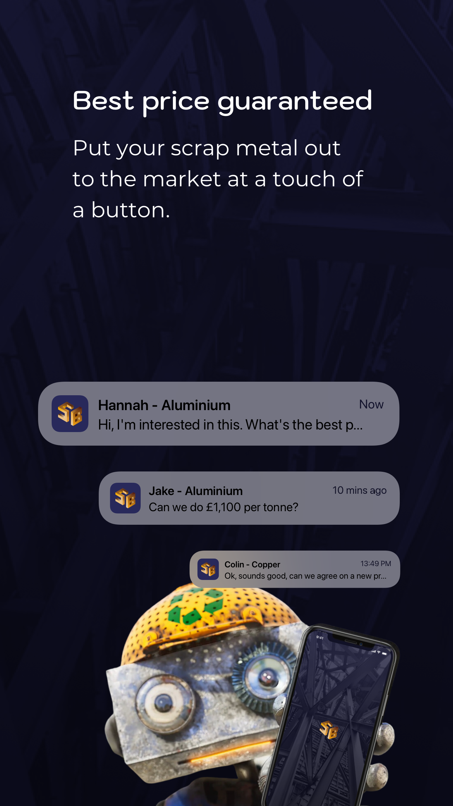
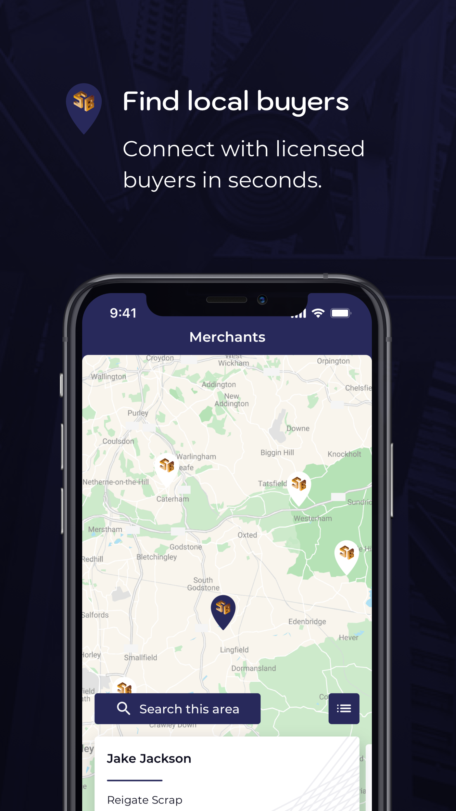
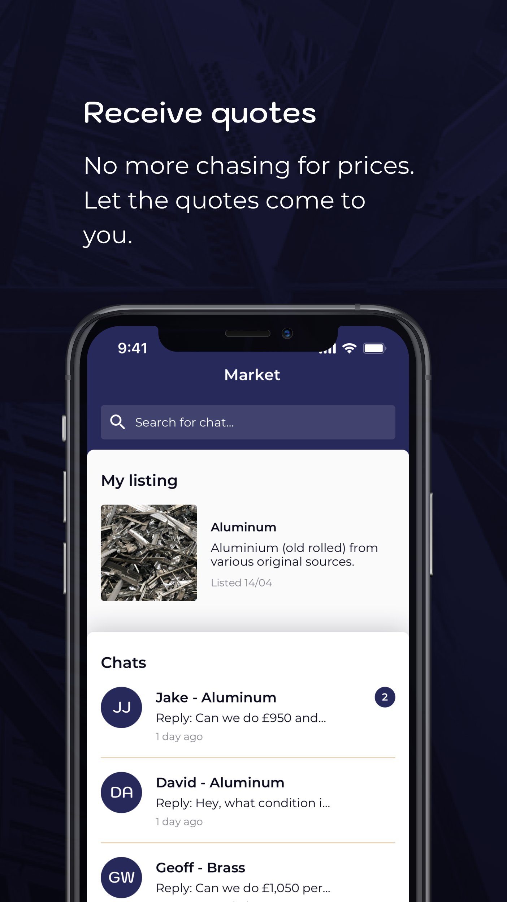
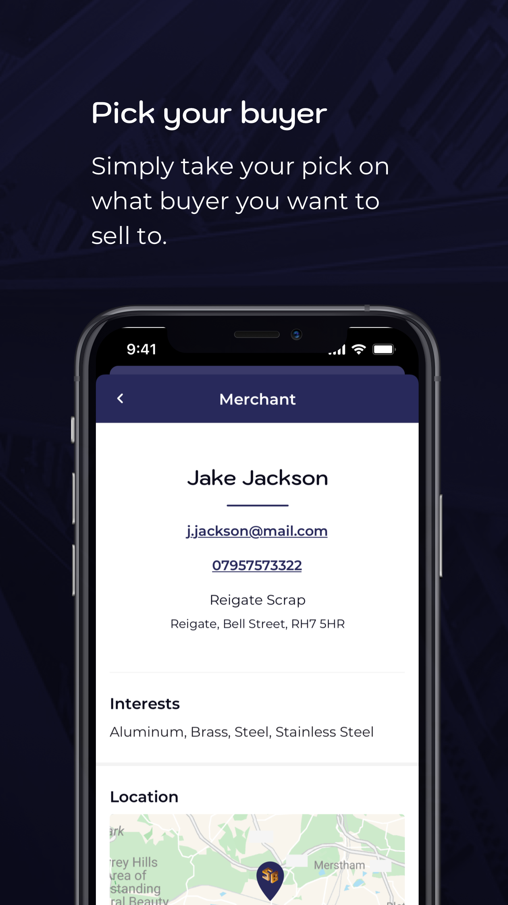

</p>

---

## Project Summary

Working on **ScrapBays** has been one of the most rewarding milestones in my Android engineering career, providing the opportunity to build a modern marketplace platform that supports the recycling industry and promotes sustainable commerce through digital innovation.

As a **Senior Android Developer**, I contributed to the design, development, enhancement, and maintenance of the Android application by implementing marketplace features, authentication workflows, product discovery, location-aware functionality, image capture and upload, order management, and seamless backend integration using modern Android technologies.

The project enabled me to apply **Jetpack Compose**, **Clean Architecture**, **MVVM**, **Kotlin Coroutines**, **Flow**, **Dagger Hilt**, and other contemporary Android development practices to build scalable, maintainable, and production-ready solutions. I also collaborated closely with cross-functional teams, participated in architectural decisions, conducted code reviews, and supported CI/CD processes to ensure reliable software delivery.

Supporting a growing platform with **10K+ users**, ScrapBays strengthened my expertise in enterprise Android development, marketplace architecture, performance optimization, reactive programming, modern UI development, and building user-centric mobile applications capable of evolving alongside business needs.

ScrapBays represents my latest commercial Android project and reflects my continued growth as a software engineer, demonstrating my ability to deliver high-quality, scalable, and business-focused mobile solutions using the latest Android technologies and engineering best practices.

---

# 💳 [VowPay – Digital Payments & Remittance Platform](https://play.google.com/store/apps/details?id=com.vowpay.vowpay)

> **Role:** Senior Android Engineer  
> **Industry:** FinTech | Digital Payments | Financial Services  
> **Platform:** Android


## Project Overview

VowPay is a modern FinTech platform that enables users to securely manage their finances through digital wallets, international money transfers, QR payments, beneficiary management, bank account linking, transaction history, identity verification (KYC), and secure authentication.

The Android application delivers a fast, secure, and intuitive mobile experience while maintaining the reliability, performance, and security standards expected from financial applications. Users can perform everyday financial operations with confidence through a seamless interface designed to simplify digital payments and cross-border transactions.

Building and maintaining the application required a strong focus on security, transaction integrity, scalable architecture, and reliable communication with backend financial services.

---

## Business Context

In today's rapidly evolving financial landscape, users expect secure, reliable, and convenient digital banking experiences accessible directly from their mobile devices. VowPay supports these expectations by providing an Android application that enables users to perform financial operations with confidence while maintaining strong security practices and regulatory compliance requirements.

Developing financial applications requires balancing user experience with strict security considerations, transaction reliability, and data integrity. Every feature must be implemented with a strong emphasis on accuracy, security, and performance to build user trust and support business growth.

As part of the Android engineering team, I contributed to delivering secure, maintainable, and scalable mobile solutions that aligned with both technical standards and business objectives.

---

## My Role

As a **Senior Android Engineer**, I collaborated with Product Managers, UX/UI Designers, Backend Engineers, QA Engineers, and fellow Android developers to design, develop, test, and maintain production-ready Android features for the VowPay platform.

My role extended beyond feature implementation to include architecture discussions, API integrations, code reviews, production issue investigation, technical planning, and continuous improvements to the Android application.

Working within Agile development teams, I participated throughout the complete software development lifecycle, ensuring that each release maintained the high standards expected from a financial application.

---

## Responsibilities

My responsibilities included:

- Designing and developing secure Android features using Kotlin and modern Android development practices.
- Implementing international money transfer workflows.
- Developing beneficiary management features for sending and managing recipients.
- Building secure digital wallet functionality.
- Implementing QR payment features for convenient financial transactions.
- Developing transaction history and transaction detail screens.
- Integrating bank account linking and account management functionality.
- Implementing biometric authentication and secure login experiences.
- Supporting OTP verification and authentication workflows.
- Participating in KYC (Know Your Customer) onboarding and identity verification flows.
- Integrating REST APIs and backend financial services.
- Applying Clean Architecture and MVVM principles throughout the application.
- Building reusable UI components using Jetpack Compose and XML.
- Collaborating closely with backend engineers to ensure secure and reliable financial transactions.
- Performing code reviews and maintaining Android engineering standards.
- Investigating production issues and implementing sustainable solutions.
- Participating in Agile ceremonies including sprint planning, backlog refinement, estimation, retrospectives, and release planning.
- Supporting CI/CD pipelines and production releases.

---

## Key Contributions

During my time on VowPay, I contributed to multiple core financial features that enhanced the overall user experience and strengthened the platform's capabilities.

Key contributions included:

- Developed secure international money transfer functionality.
- Built beneficiary management features allowing users to manage transfer recipients efficiently.
- Implemented digital wallet features supporting everyday financial operations.
- Developed QR payment functionality to simplify digital transactions.
- Built transaction history screens with detailed transaction information.
- Integrated bank account linking workflows to improve account management.
- Implemented biometric authentication for secure and convenient user access.
- Developed OTP verification flows to strengthen account security.
- Contributed to KYC onboarding and identity verification features.
- Integrated backend financial services using REST APIs.
- Utilized Kotlin Coroutines and Flow for asynchronous programming and state management.
- Applied Clean Architecture and MVVM to support scalable application development.
- Built reusable UI components that improved consistency and maintainability.
- Participated in architecture discussions supporting long-term application scalability.
- Conducted code reviews and promoted Android engineering best practices.
- Collaborated closely with Product Managers, Designers, Backend Engineers, and QA teams to deliver high-quality financial solutions.

---
## Architecture

The VowPay Android application was designed using modern Android architecture principles to ensure security, scalability, maintainability, and reliability. Given the nature of financial applications, the architecture emphasized clean separation of responsibilities, secure communication, modular development, and efficient state management while supporting continuous product enhancements.

### Architectural Principles

- Clean Architecture
- MVVM (Model-View-ViewModel)
- Repository Pattern
- SOLID Principles
- Modular Architecture
- Dependency Injection
- Reactive Programming
- Secure API Communication

### Architecture Overview

```text
Presentation Layer
│
├── Jetpack Compose / XML
├── ViewModels
├── UI State Management
│
Domain Layer
│
├── Use Cases
├── Business Logic
│
Data Layer
│
├── Repository
├── REST APIs
├── Local Storage
├── Firebase Services
│
Core Libraries
│
├── Dagger Hilt
├── Kotlin Coroutines
├── Kotlin Flow
```

The architecture provided several advantages:

- Clear separation between presentation, business logic, and data layers.
- Improved maintainability and scalability.
- Better code reusability.
- Easier testing and debugging.
- Simplified feature development.
- Efficient collaboration across engineering teams.
- Long-term support for continuous product evolution.

---

## Engineering Challenges

Developing a FinTech application required balancing security, usability, and performance while ensuring a seamless user experience.

Key engineering challenges included:

- Implementing secure authentication through biometric login and OTP verification.
- Developing reliable international money transfer workflows while maintaining transaction integrity.
- Managing complex financial states during payment processing and transaction execution.
- Integrating multiple backend financial services while ensuring reliable API communication.
- Supporting KYC onboarding and identity verification workflows.
- Maintaining application stability across different Android devices and operating system versions.
- Ensuring accurate synchronization of transaction history and wallet balances.
- Delivering secure QR payment functionality with a responsive user experience.
- Maintaining clean architecture while supporting continuous product evolution.
- Collaborating with cross-functional teams to deliver secure and reliable financial services.

### Secure Financial Operations

Financial applications require secure communication between mobile clients and backend systems while protecting sensitive user information and ensuring transaction integrity.

### Reliable API Integration

Maintaining reliable communication with backend services while handling network failures, server responses, and transaction states required careful implementation and robust error handling.

### Responsive User Experience

Financial operations should feel responsive and intuitive while processing data securely in the background without compromising user experience.

### Application Stability

Since users rely on financial applications for important daily transactions, maintaining stability and minimizing production issues was a continuous priority.

### Scalable Feature Development

As business requirements evolved, the Android application needed to support new financial services while preserving maintainability and minimizing technical debt.

### Cross-functional Collaboration

Developing secure financial features required continuous collaboration with Product Managers, Backend Engineers, QA Engineers, Designers, and other Android developers to ensure technical accuracy and business alignment.

---

## Business Impact

My contributions helped strengthen VowPay's Android platform by delivering secure, scalable, and user-friendly financial solutions that supported the company's digital payment ecosystem.

Through the implementation of international money transfers, wallet management, QR payments, beneficiary management, KYC onboarding, secure authentication, and transaction history features, I contributed to improving the overall user experience while maintaining high standards of reliability, security, and software quality.

By applying modern Android architecture and engineering best practices, I helped support the platform's long-term scalability and continuous product evolution.
---

## Key Achievements

Throughout the project, I contributed to delivering secure, scalable, and production-ready Android features while maintaining high engineering standards.

Key achievements include:

- Delivered production-ready financial features supporting digital payments and international money transfers.
- Successfully implemented beneficiary management and transaction history functionality.
- Built secure digital wallet and bank account linking features.
- Developed QR payment capabilities to improve payment accessibility.
- Implemented biometric authentication and OTP verification for enhanced account security.
- Contributed to KYC onboarding and identity verification workflows.
- Applied Clean Architecture and MVVM principles to improve scalability and maintainability.
- Integrated backend financial services through secure REST API communication.
- Utilized Kotlin Coroutines and Flow to simplify asynchronous operations.
- Conducted code reviews and maintained Android engineering standards.
- Investigated production issues and implemented sustainable solutions using structured debugging approaches.
- Collaborated with Product Managers, Designers, Backend Engineers, and QA teams throughout the software development lifecycle.
- Supported Agile software delivery through sprint planning, backlog refinement, estimation, and release planning.
- Contributed to reliable CI/CD pipelines and continuous product improvements.

---

## Professional Growth

Working on VowPay strengthened my expertise in enterprise FinTech application development and modern Android engineering practices.

The project enhanced my experience in:

- Secure Android application development.
- Financial application architecture.
- Clean Architecture and MVVM.
- API integration.
- Kotlin development.
- Kotlin Coroutines and Flow.
- Modular application design.
- Production debugging and monitoring.
- Code reviews and engineering collaboration.
- Agile software development.
- Continuous Integration and Continuous Delivery (CI/CD).
- Building scalable Android applications for financial services.

---
## Technologies

The VowPay Android application was developed using modern Android technologies, frameworks, and architectural patterns to deliver a secure, scalable, and maintainable financial platform.

| Category | Technologies |
|-----------|--------------|
| **Programming Languages** | Kotlin, Java |
| **UI Development** | Jetpack Compose, XML, Material Design |
| **Architecture** | Clean Architecture, MVVM, Repository Pattern, SOLID Principles, Modular Architecture |
| **Asynchronous Programming** | Kotlin Coroutines, Kotlin Flow, StateFlow |
| **Networking** | Retrofit, OkHttp, REST APIs |
| **Local Storage** | Room, DataStore, SharedPreferences |
| **Dependency Injection** | Dagger Hilt |
| **Firebase** | Firebase Authentication, Firebase Analytics, Firebase Cloud Messaging (FCM), Firebase Crashlytics |
| **Testing** | JUnit, MockK, Unit Testing |
| **CI/CD** | GitHub Actions, Bitrise |
| **Development Tools** | Android Studio, Git, GitHub, Jira, Figma |

---

## Engineering Practices

Throughout the development of VowPay, I followed modern Android engineering practices to ensure high code quality, maintainability, scalability, and reliable software delivery.

Engineering practices included:

- Writing clean, maintainable, and well-structured Kotlin code.
- Following Clean Architecture and SOLID principles throughout the application.
- Building reusable UI components to improve consistency and reduce code duplication.
- Implementing scalable MVVM architecture for better separation of concerns.
- Conducting code reviews to maintain coding standards and improve software quality.
- Collaborating with cross-functional teams throughout the complete development lifecycle.
- Participating in architecture discussions and technical planning.
- Debugging production issues and implementing sustainable fixes.
- Supporting Agile software development and iterative product delivery.
- Contributing to continuous integration and deployment processes.

---

## Skills Demonstrated

The VowPay project strengthened my expertise in Android application development for financial services while reinforcing modern engineering principles and collaborative software development.

### Technical Skills

- Android SDK
- Kotlin
- Jetpack Compose
- XML
- Clean Architecture
- MVVM
- Repository Pattern
- SOLID Principles
- Retrofit
- REST APIs
- Room
- Kotlin Coroutines
- Kotlin Flow
- Dagger Hilt
- Firebase
- CI/CD
- GitHub Actions
- Bitrise

### Engineering Skills

- Mobile Application Architecture
- Financial Application Development
- Feature Development
- Software Design
- Performance Optimization
- Production Support
- API Integration
- Code Review
- Debugging
- Root Cause Analysis
- Agile Development
- Cross-functional Collaboration
- Technical Planning
- Continuous Improvement
- Software Quality

---

## Screenshots

The following screenshots showcase key areas of the VowPay Android application, demonstrating the user experience, financial workflows, and application interface.

<p align="center">

<!-- Replace these with your actual screenshots -->

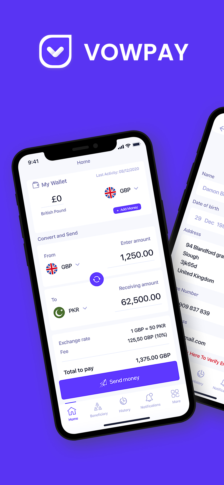
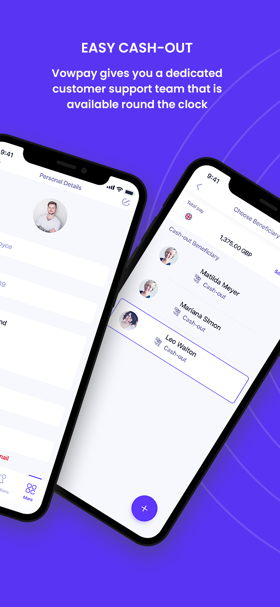
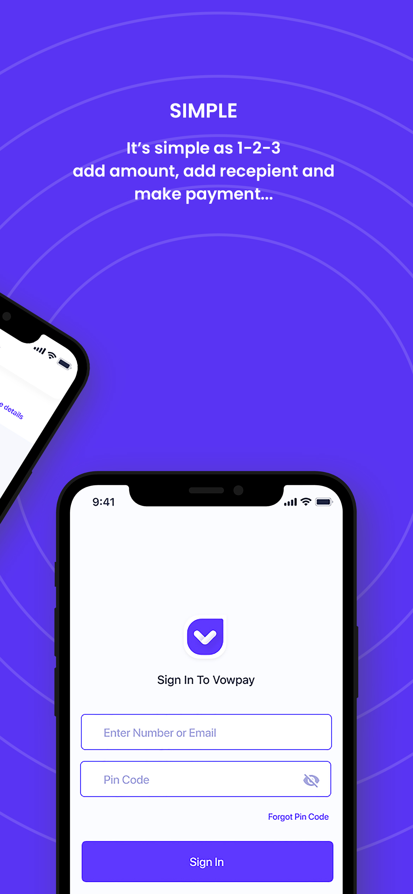
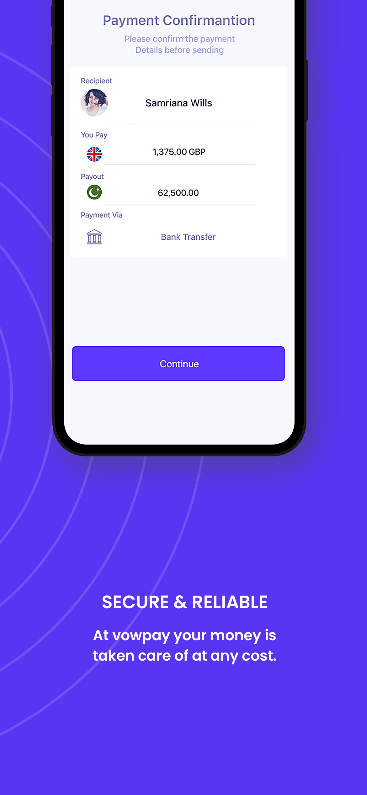

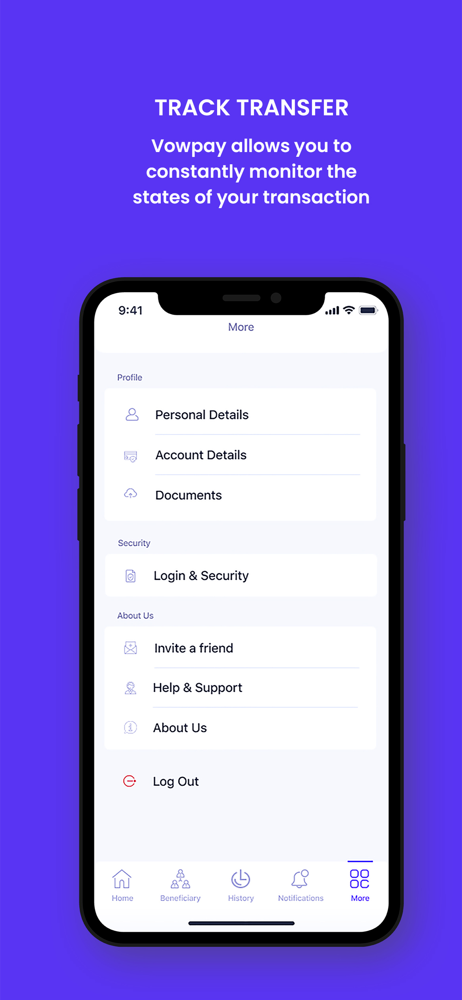


</p>

---

## Project Summary

Working on **VowPay** provided valuable experience in developing secure, scalable, and production-ready Android applications within the FinTech domain. The project required a strong focus on application reliability, maintainability, and seamless integration with backend financial services while delivering an intuitive and responsive user experience.

Throughout the project, I contributed to designing and implementing Android features, improving application architecture, integrating backend services, maintaining software quality, and supporting continuous product evolution. By applying modern Android development practices, Clean Architecture, and collaborative engineering approaches, I helped build a maintainable and scalable mobile application capable of supporting evolving business requirements.

The project strengthened my expertise in enterprise Android development, financial application architecture, API integration, asynchronous programming with Kotlin Coroutines and Flow, production support, CI/CD, and cross-functional collaboration. It also reinforced the importance of writing secure, maintainable, and user-focused software that aligns with both technical standards and business objectives.

VowPay represents an important milestone in my professional journey, showcasing my ability to contribute effectively to modern FinTech solutions while delivering high-quality Android applications using industry best practices and scalable software engineering principles.

---

# 💳 YAP – Multi-Region Digital Banking & Personal Finance Platform

> **Role:** Senior Android Engineer
> **Industry:** FinTech | Digital Banking | Personal Finance
> **Platform:** Android
> 🌍 **Multi-Region Platform:** Supporting Digital Banking Services across the United Arab Emirates (UAE) & Pakistan
> [**YAP UAE:**](https://www.yap.com/)
> [**YAP PAKISTAN:**](https://play.google.com/store/apps/details?id=com.yappakistan.app)

---

## Project Overview

YAP is a modern **multi-region digital banking platform** that delivers secure, intuitive, and customer-centric financial services across multiple markets. The Android application enables users to manage their finances through a seamless mobile experience while supporting region-specific banking products, regulatory requirements, and localized customer journeys.

The platform provides a comprehensive suite of digital banking capabilities, including digital wallet management, virtual and physical debit cards, local and international money transfers, QR payments, bill payments, mobile top-ups, rewards and cashback programs, budgeting tools, spending insights, secure authentication, and customer onboarding.

Designed for scalability and regional expansion, YAP delivers a consistent user experience while supporting country-specific banking regulations, payment integrations, currencies, and financial services across different markets.

---

## Business Context

Digital banking products operating across multiple countries must balance a consistent customer experience with diverse regulatory frameworks, banking partners, payment infrastructures, and localized business requirements.

YAP addresses these challenges by providing a unified digital banking platform capable of supporting multiple regions through configurable business logic, scalable architecture, and reusable mobile components. This enables new market expansion while maintaining security, regulatory compliance, performance, and high engineering quality.

As part of the Android engineering team, I contributed to building secure, scalable, and production-ready mobile solutions that supported regional banking requirements while maintaining a consistent user experience across markets.

---

## My Role

As a **Senior Android Engineer**, I collaborated with Product Managers, UX/UI Designers, Backend Engineers, QA Engineers, and fellow Android engineers to develop and maintain Android features for a multi-region digital banking platform.

My responsibilities extended beyond feature implementation to include architecture discussions, technical planning, reusable component development, production support, code reviews, and continuous platform improvements. Working within Agile teams, I contributed to delivering secure, scalable, and maintainable financial solutions capable of supporting multiple regional deployments.

---

## Responsibilities

My responsibilities included:

- Developing secure Android features using Kotlin and modern Android development practices.
- Building scalable banking functionality supporting multiple regional deployments.
- Developing digital wallet capabilities for everyday financial operations.
- Implementing virtual and physical debit card management features.
- Building card activation, freeze/unfreeze, PIN management, and card control functionality.
- Developing local and international money transfer workflows.
- Implementing QR payments, bill payments, and mobile top-up functionality.
- Building transaction history, spending insights, and personal finance features.
- Developing rewards, cashback, and customer engagement capabilities.
- Supporting budgeting and financial management tools.
- Contributing to KYC onboarding and customer identity verification workflows.
- Implementing biometric authentication and secure authentication mechanisms.
- Integrating REST APIs with backend financial services.
- Supporting region-specific business rules and localized banking experiences.
- Building reusable UI components and shared business logic for multiple markets.
- Applying Clean Architecture and MVVM principles throughout the application.
- Participating in architecture discussions, technical planning, and implementation reviews.
- Conducting code reviews and maintaining Android engineering best practices.
- Investigating production issues using Firebase Crashlytics.
- Collaborating with Product Managers, Designers, Backend Engineers, and QA teams throughout the product lifecycle.
- Supporting Agile software development, sprint planning, estimation, backlog refinement, and production releases.

---

## Key Contributions

During my time on YAP, I contributed to developing and enhancing core banking capabilities that supported secure digital financial services across multiple regions.

Key contributions included:

- Developed production-ready Android features for a multi-region digital banking platform.
- Built secure digital wallet functionality supporting everyday financial transactions.
- Developed virtual and physical debit card management features.
- Implemented card activation, freeze/unfreeze, PIN management, and card control workflows.
- Built local and international money transfer functionality.
- Developed QR payments, bill payments, and mobile recharge capabilities.
- Implemented transaction history, spending insights, and budgeting features.
- Built rewards and cashback experiences that improved customer engagement.
- Contributed to KYC onboarding and customer verification workflows.
- Implemented biometric authentication and secure login mechanisms.
- Supported regional banking requirements through configurable and reusable application components.
- Integrated backend financial services using REST APIs.
- Utilized Kotlin Coroutines and Flow for asynchronous programming and reactive state management.
- Applied Clean Architecture and MVVM to improve scalability and long-term maintainability.
- Developed reusable UI components that accelerated feature delivery across multiple markets.
- Participated in architecture discussions, code reviews, and technical planning.
- Collaborated closely with cross-functional teams to deliver secure, scalable, and user-focused digital banking experiences across multiple regional deployments.

---
# Architecture

YAP was built using a modern, scalable Android architecture designed to support a multi-region digital banking platform while maintaining a consistent user experience across different markets. The architecture emphasizes modularity, security, maintainability, and reusability, enabling rapid feature development and efficient adaptation to regional banking requirements.

By adopting Clean Architecture, MVVM, and reactive programming principles, the application separates business logic, presentation, and data layers, allowing engineering teams to develop, test, and evolve features independently while maintaining long-term scalability.

### Architectural Principles

- Clean Architecture
- MVVM (Model–View–ViewModel)
- Repository Pattern
- SOLID Principles
- Modular Architecture
- Dependency Injection
- Reactive Programming
- Unidirectional Data Flow
- Reusable Feature Components
- Configurable Multi-Region Architecture

### Architecture Overview

```text
Presentation Layer
│
├── Jetpack Compose
├── XML (Legacy & Shared Screens)
├── ViewModels
├── UI State Management
│
Domain Layer
│
├── Business Logic
├── Use Cases
├── Regional Business Rules
│
Data Layer
│
├── Repository
├── REST APIs
├── Local Storage
├── Secure Data Handling
│
Core Components
│
├── Dagger Hilt
├── Kotlin Coroutines
├── Kotlin Flow
├── WorkManager
├── Firebase
```

The architecture enabled:

- Scalable feature development across multiple regions.
- Reusable business logic and UI components.
- Region-specific feature configuration without duplicating code.
- Secure handling of financial data.
- Improved maintainability and testability.
- Faster onboarding of new banking capabilities.
- Long-term platform scalability.

---

# Engineering Challenges

Developing a multi-region digital banking application required balancing security, performance, scalability, regulatory requirements, and an excellent customer experience.

## Multi-Region Product Development

Supporting multiple markets meant accommodating regional business rules, banking partners, currencies, payment providers, and localized customer experiences while maintaining a unified Android codebase.

## Secure Financial Workflows

Financial applications require a strong focus on security, reliability, and data integrity. Features involving authentication, money transfers, card management, and customer onboarding were implemented with secure engineering practices while ensuring a seamless user experience.

## Reusable Platform Development

As the platform expanded, reusable UI components and shared business logic became essential for accelerating development and maintaining consistency across regional deployments.

## Product Evolution

Digital banking products evolve rapidly. Continuous feature enhancements, improvements to existing functionality, and close collaboration with Product teams ensured the application remained competitive while maintaining technical quality.

## Performance & Stability

Providing a responsive and reliable banking experience required optimizing application performance, reducing technical debt, monitoring production issues, and continuously improving application stability.

## Cross-Functional Collaboration

Successful delivery depended on collaboration with Product Managers, UX/UI Designers, Backend Engineers, QA Engineers, and stakeholders to translate complex financial requirements into scalable Android solutions.

---

# Business Impact

YAP delivers a modern digital banking experience by providing customers with secure and convenient access to financial services through a single mobile application.

My contributions focused on building scalable Android features that improved digital banking workflows, enhanced customer engagement, and supported regional platform expansion. By implementing reusable components, modern architecture, and secure integrations, I helped create a maintainable platform capable of supporting multiple markets while delivering a consistent user experience.

The project's architecture and engineering practices enabled faster feature delivery, improved long-term maintainability, and supported the continued growth of YAP's digital banking ecosystem.

---

# Key Achievements

Throughout the project, I contributed to delivering secure, scalable, and production-ready Android solutions for a multi-region digital banking platform.

Key achievements include:

- Developed production-ready Android features using Kotlin and modern Android technologies.
- Built digital wallet functionality supporting everyday financial operations.
- Developed virtual and physical debit card management capabilities.
- Implemented secure card controls, including activation, freeze/unfreeze, and PIN management.
- Built local and international money transfer workflows.
- Developed QR payments, bill payments, and mobile top-up functionality.
- Implemented transaction history, spending insights, budgeting, rewards, and cashback features.
- Contributed to secure KYC onboarding and customer verification workflows.
- Implemented biometric authentication and secure login experiences.
- Supported multi-region deployments through configurable architecture and reusable components.
- Integrated backend financial services using REST APIs.
- Applied Clean Architecture, MVVM, and Repository Pattern to improve scalability and maintainability.
- Utilized Kotlin Coroutines and Flow for efficient asynchronous programming and reactive state management.
- Developed reusable UI components that accelerated development across multiple regional markets.
- Participated in architecture discussions, code reviews, and technical planning.
- Investigated production issues using Firebase Crashlytics and implemented sustainable long-term improvements.
- Collaborated closely with cross-functional teams to deliver secure, reliable, and user-centric financial solutions.

---

# Professional Growth

Working on YAP significantly strengthened my expertise in enterprise FinTech application development and large-scale digital banking platforms.

The project expanded my experience in:

- Digital Banking Platforms
- Multi-Region Product Development
- Enterprise FinTech Solutions
- Secure Mobile Application Development
- Clean Architecture
- MVVM
- Modular Application Design
- Kotlin Coroutines & Flow
- REST API Integration
- Financial Security Best Practices
- Reusable Component Development
- Product Engineering
- Cross-Functional Collaboration
- Agile Software Development
- Production Support
- Building Scalable Financial Applications

---
# Technologies

YAP was developed using a modern Android technology stack designed to support a secure, scalable, and high-performance digital banking platform operating across multiple regions. The application leverages industry-standard frameworks, architectural patterns, and engineering practices to deliver reliable financial services while maintaining long-term maintainability and scalability.

| Category | Technologies |
|-----------|--------------|
| **Programming Languages** | Kotlin |
| **UI Development** | Jetpack Compose, XML, Material Design |
| **Architecture** | Clean Architecture, MVVM, Repository Pattern, SOLID Principles, Modular Architecture |
| **Asynchronous Programming** | Kotlin Coroutines, Kotlin Flow, StateFlow |
| **Networking** | Retrofit, OkHttp, REST APIs |
| **Dependency Injection** | Dagger Hilt |
| **Background Processing** | WorkManager |
| **Security** | Biometric Authentication, Secure Storage, OTP Verification |
| **Firebase** | Firebase Cloud Messaging (FCM), Firebase Analytics, Firebase Crashlytics |
| **Development Tools** | Android Studio, Git, GitHub, Jira, Postman, Figma |
| **CI/CD** | Bitrise, GitHub Actions |

---

# Engineering Practices

Working on YAP provided valuable experience in building enterprise-grade FinTech applications while following modern Android engineering principles and secure software development practices.

Engineering practices included:

- Developing secure Android applications using Kotlin and modern Android development practices.
- Applying Clean Architecture and SOLID principles throughout the application.
- Building reusable UI components and shared business logic to support multiple regional deployments.
- Utilizing Kotlin Coroutines and Flow for asynchronous programming and reactive state management.
- Designing scalable features capable of supporting region-specific banking requirements.
- Implementing secure authentication and customer verification workflows.
- Integrating REST APIs with banking and financial services.
- Conducting code reviews and maintaining Android engineering standards.
- Participating in architecture discussions, technical planning, and implementation reviews.
- Monitoring production stability using Firebase Crashlytics and Analytics.
- Collaborating with Product Managers, UX/UI Designers, Backend Engineers, and QA Engineers.
- Supporting Agile software development through sprint planning, backlog refinement, estimation, retrospectives, and release planning.
- Contributing to CI/CD pipelines for reliable production deployments.

---

# Skills Demonstrated

The YAP project demonstrates extensive experience in enterprise FinTech application development, multi-region product engineering, and secure mobile banking solutions.

## Technical Skills

- Android SDK
- Kotlin
- Jetpack Compose
- XML
- Material Design
- Clean Architecture
- MVVM
- Repository Pattern
- SOLID Principles
- Modular Architecture
- Kotlin Coroutines
- Kotlin Flow
- StateFlow
- Retrofit
- OkHttp
- REST API Integration
- Dagger Hilt
- WorkManager
- Firebase Cloud Messaging (FCM)
- Firebase Analytics
- Firebase Crashlytics
- Biometric Authentication
- OTP Verification
- Git
- GitHub
- Jira
- CI/CD

---

## FinTech Domain Expertise

- Digital Banking
- Multi-Region Financial Platforms
- Digital Wallets
- Personal Finance
- Debit Card Management
- International Money Transfers
- Local Money Transfers
- QR Payments
- Bill Payments
- Mobile Top-Ups
- KYC Onboarding
- Customer Verification
- Spending Analytics
- Budgeting Features
- Rewards & Cashback
- Secure Authentication
- Financial Security
- Regulatory Compliance

---

## Engineering Skills

- Enterprise Android Development
- FinTech Product Engineering
- Multi-Region Application Development
- Secure Mobile Application Development
- Reusable Component Design
- API Integration
- Reactive Programming
- State Management
- Production Debugging
- Root Cause Analysis
- Performance Optimization
- Code Reviews
- Cross-Functional Collaboration
- Agile Software Development
- Continuous Delivery
- Scalable Mobile Architecture

---

# Screenshots

The following screenshots showcase the **YAP Digital Banking** application, highlighting digital wallet management, account overview, card management, money transfers, QR payments, transaction history, budgeting tools, rewards, and other core financial services that deliver a secure and seamless banking experience across multiple regional markets.

<p align="center">

&nbsp;&nbsp;&nbsp;&nbsp;&nbsp;&nbsp;&nbsp;&nbsp;&nbsp;&nbsp;&nbsp;&nbsp;&nbsp;&nbsp;&nbsp;
&nbsp;&nbsp;&nbsp;&nbsp;&nbsp;
&nbsp;&nbsp;&nbsp;&nbsp;&nbsp;
&nbsp;&nbsp;&nbsp;&nbsp;&nbsp;
&nbsp;&nbsp;&nbsp;&nbsp;&nbsp;


</p>

---

# Project Summary

Working on **YAP** provided the opportunity to contribute to a modern, multi-region digital banking platform that delivers secure, scalable, and customer-centric financial services across different markets.

As a **Senior Android Engineer**, I contributed to designing, developing, and maintaining production-ready Android features supporting digital wallets, debit card management, money transfers, QR payments, budgeting, rewards, secure authentication, and customer onboarding. My work also included implementing reusable components, integrating backend financial services, improving application performance, participating in architecture discussions, and maintaining high engineering standards throughout the product lifecycle.

The project strengthened my expertise in enterprise FinTech, secure mobile application development, multi-region product engineering, scalable Android architecture, and cross-functional collaboration. It also enhanced my ability to build reliable, maintainable, and business-focused mobile solutions that support regional expansion while delivering a consistent and secure customer experience.

YAP represents a significant milestone in my Android engineering journey, demonstrating my ability to develop enterprise-grade financial applications that balance security, scalability, performance, and exceptional user experience across multiple markets.


---

# [BARQ Stores](https://play.google.com/store/apps/details?id=com.kaakati.barqmerchant)
Best and secure channel to send your luggage, jewelry and expensive material with ease. Setup luggage pick-location and recipient information and leave the rest to us.

### My Role ###
 Android developer. My responsibilites were to communicate with product owner, guide UI/UX team about the future flows, Impletent the User requirements. 

### Technologies ###
* Java
* Kotlin
* Room Db
* Lottie animations
* Glide
* Google maps
* Push Notifications
* Okhttp3
* Google Location services
* Firebase
* Payment gateways
<p align="center">
&nbsp;&nbsp;&nbsp;&nbsp;&nbsp;&nbsp;&nbsp;&nbsp;&nbsp;&nbsp;&nbsp;&nbsp;&nbsp;&nbsp;&nbsp;
 &nbsp;&nbsp;&nbsp;&nbsp;&nbsp;
</p>

 # [BARQ Fleet](https://play.google.com/store/apps/details?id=com.kaakati.barqcaptain)
Truly innovative idea to make money by carrying parcels with your luggage. Pick the parcel from your nearest locations, deliver at your destination to make money.

### My Role ###
As Android Developer gathhered the user requirements and implement into the cutting edge features.

### Technologies ###
* Java
* Kotlin
* Room Db
* Lottie animations
* Glide
* Google maps
* Push Notifications
* Okhttp3
* Google Location services
* Firebase
* Map clustering
* Payment gateways

<p align="center">
&nbsp;&nbsp;&nbsp;&nbsp;&nbsp;&nbsp;&nbsp;&nbsp;&nbsp;&nbsp;&nbsp;&nbsp;&nbsp;&nbsp;&nbsp;&nbsp;&nbsp;&nbsp;&nbsp;&nbsp;
 &nbsp;&nbsp;&nbsp;&nbsp;&nbsp;
</p>

# [Maggsha](https://www.ilsainteractive.com/chbib/)
Maggasha is aware of its responsibility toward customers and the environment and committed as a trendsetter and market leader striving to match our customer demands across industry segments. We are dedicated to offering the best environment friendly and genuine products backed by a professional network for after-sales support, through its network of branches and subsidiaries across the Kingdom.

I'm extremely pleased with how the project came out. I'm particularly proud of the app's animation, UI design, and easily-extended architecture (MVVM). Maggasha is built with Android Studio and written entirely in Java/Kotlin.

### My Role ###
Senior Android developer Communicating with client, understanding requirements and sprint planning.

### Technologies ###
* Kotlin/Java
* Dagger2
* Junit
* RxJava
* MVVM
* Glide
* Push Notifications
* Firebase
* GoogleMaps
* Payment gateways
* Lottie-Animations
<p align="center">

</p>
 
 
 # [Literacy Assessment Drive (LAD)](https://play.google.com/store/apps/details?id=qodit.com.lad)
LAD is an android application developed by Non Formal Education Assessment & Examination Cell to fulfill the purpose of Formative Assessment. This application is used by Non Formal Education Assessors to assess the students of non formal basic institutions. The corresponding web dashboard gives complete picture of assessment results.

### My Role ###
As Android Developer gathhered the user requirements and implement into the cutting edge features.

### Technologies ###
* Java
* Kotlin
* Room Db
* Lottie animations
* Glide
* Google maps
* Push Notifications
* Okhttp3
* Camera API 2
* Image rotation and capture in base64
* Google Location services
* Firebase
* Map clustering
* Payment gateways

<p align="center">
&nbsp;&nbsp;&nbsp;&nbsp;&nbsp;&nbsp;&nbsp;&nbsp;&nbsp;&nbsp;&nbsp;&nbsp;&nbsp;&nbsp;&nbsp;
</p>


### Stack over flow Contributions ###
I am an active contributor on stackoverflow  : 
https://stackoverflow.com/story/taniisr
